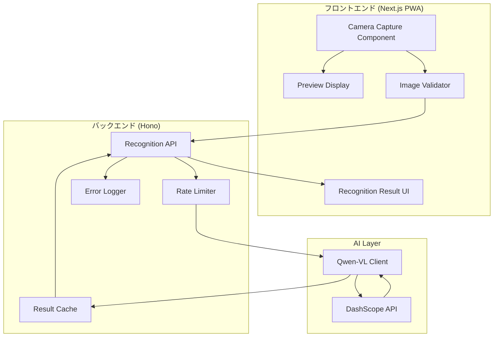
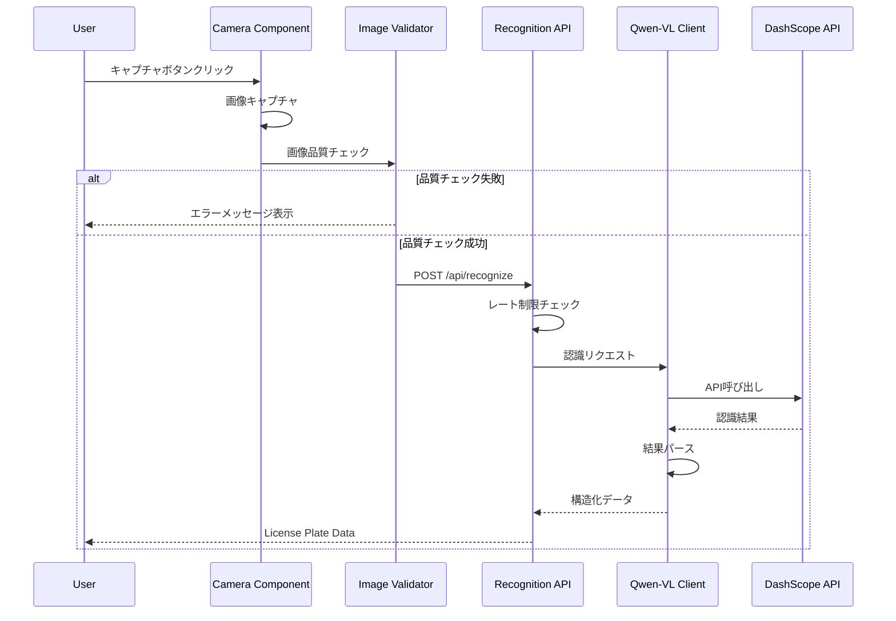

# 設計書

## 概要

本設計書は、ナンバープレート認識機能の技術的な実装方針を定義します。この機能は、フロントエンド（Next.js PWA）でのカメラキャプチャ、バックエンド（Hono）でのAPI処理、AI（Qwen-VL）での画像認識を統合し、日本のナンバープレートを高精度で認識するシステムを構築します。

### 設計目標

- 認識精度98%以上
- 処理時間150ms以内
- リアルタイム認識とシングルショット認識の両対応
- 日本の全ナンバープレート形式への対応
- 堅牢なエラーハンドリング

## アーキテクチャ

### システム構成図



### データフロー



## コンポーネントとインターフェース

### フロントエンドコンポーネント

#### CameraCaptureComponent

カメラからの画像キャプチャを担当するReactコンポーネント。

```typescript
// pkgs/frontend/components/license-plate/CameraCapture.tsx

interface CameraCaptureProps {
  mode: 'single' | 'realtime';
  onCapture: (image: CapturedImage) => void;
  onError: (error: CaptureError) => void;
}

interface CapturedImage {
  base64: string;
  width: number;
  height: number;
  timestamp: number;
}

interface CaptureError {
  code: 'PERMISSION_DENIED' | 'DEVICE_NOT_FOUND' | 'CAPTURE_FAILED';
  message: string;
}
```

#### ImageValidator

画像品質を検証するユーティリティ。

```typescript
// pkgs/frontend/lib/license-plate/image-validator.ts

interface ValidationResult {
  isValid: boolean;
  errors: ValidationError[];
}

interface ValidationError {
  code: 'BLUR' | 'ANGLE' | 'LIGHTING_DARK' | 'LIGHTING_BRIGHT' | 'RESOLUTION';
  message: string;
  suggestion: string;
}

function validateImage(image: CapturedImage): ValidationResult;
```

#### RecognitionResultDisplay

認識結果を表示するコンポーネント。

```typescript
// pkgs/frontend/components/license-plate/RecognitionResult.tsx

interface RecognitionResultProps {
  result: LicensePlateData | null;
  isLoading: boolean;
  error: RecognitionError | null;
}
```

### バックエンドAPI

#### Recognition API Endpoint

```typescript
// pkgs/x402server/src/routes/license-plate.ts

// POST /api/license-plate/recognize
interface RecognizeRequest {
  image: string; // Base64 encoded image
  mode: 'single' | 'realtime';
}

interface RecognizeResponse {
  success: boolean;
  data?: LicensePlateData;
  error?: RecognitionError;
  processingTime: number; // milliseconds
}
```

### 共通データ型

#### LicensePlateData

```typescript
// pkgs/frontend/types/license-plate.ts

interface LicensePlateData {
  // 構造化データ
  region: string;           // 地名（例：品川、横浜）
  classificationNumber: string; // 分類番号（例：300、500）
  hiragana: string;         // ひらがな（例：あ、か、さ）
  serialNumber: string;     // 一連番号（例：1234）

  // 完全な文字列
  fullText: string;         // 例：品川330あ1234

  // メタデータ
  confidence: number;       // 認識信頼度（0-100）
  plateType: PlateType;     // ナンバープレートの種類
  recognizedAt: number;     // タイムスタンプ
}

type PlateType =
  | 'REGULAR'      // 普通自動車（白地に緑文字）
  | 'LIGHT'        // 軽自動車（黄色地に黒文字）
  | 'COMMERCIAL'   // 事業用（緑地に白文字）
  | 'RENTAL'       // レンタカー（わ、れナンバー）
  | 'DIPLOMATIC';  // 外交官（青地に白文字）
```

#### RecognitionError

```typescript
// pkgs/frontend/types/license-plate.ts

interface RecognitionError {
  code: RecognitionErrorCode;
  message: string;
  suggestion: string;
  partialData?: Partial<LicensePlateData>;
}

type RecognitionErrorCode =
  | 'NO_PLATE_DETECTED'
  | 'PARTIAL_RECOGNITION'
  | 'API_CONNECTION_FAILED'
  | 'TIMEOUT'
  | 'RATE_LIMITED'
  | 'INVALID_IMAGE';
```

### Qwen-VL クライアント

```typescript
// pkgs/x402server/src/lib/qwen-vl-client.ts

interface QwenVLClient {
  recognize(image: string): Promise<QwenRecognitionResult>;
}

interface QwenRecognitionResult {
  rawText: string;
  parsedData: LicensePlateData | null;
  confidence: number;
  processingTime: number;
}

interface QwenVLConfig {
  apiKey: string;
  model: 'qwen-vl-plus' | 'qwen-vl-max';
  timeout: number;
  maxRetries: number;
}
```

## データモデル

### 認識結果キャッシュ

```typescript
// キャッシュキー: SHA256(image_base64)
interface CachedRecognition {
  key: string;
  result: LicensePlateData;
  createdAt: number;
  expiresAt: number; // 5分後
}
```

### 認識ログ

```typescript
interface RecognitionLog {
  id: string;
  timestamp: number;
  imageHash: string; // プライバシー保護のためハッシュのみ
  success: boolean;
  processingTime: number;
  errorCode?: RecognitionErrorCode;
  confidence?: number;
}
```

### Qwen-VL プロンプト設計

```typescript
const RECOGNITION_PROMPT = `
この画像に写っている日本のナンバープレートを認識してください。
以下の形式でJSONを返してください：

{
  "detected": true/false,
  "region": "地名（例：品川）",
  "classificationNumber": "分類番号（例：330）",
  "hiragana": "ひらがな（例：あ）",
  "serialNumber": "一連番号（例：1234）",
  "plateType": "REGULAR/LIGHT/COMMERCIAL/RENTAL/DIPLOMATIC",
  "confidence": 0-100の数値
}

ナンバープレートが検出できない場合は {"detected": false} を返してください。
`;
```


## 正確性プロパティ

*プロパティとは、システムの全ての有効な実行において真であるべき特性や振る舞いです。プロパティは、人間が読める仕様と機械で検証可能な正確性保証の橋渡しをします。*

### Property 1: 画像キャプチャの有効性

*任意の* カメラストリームからキャプチャされた画像に対して、出力は有効なBase64文字列であり、幅と高さが640x480ピクセル以上であること。

**Validates: Requirements 1.1, 1.5**

### Property 2: 画像検証の完全性

*任意の* キャプチャされた画像に対して、Image_Validatorは必ずぼやけ、角度、照明の3つの品質チェックを実行し、ValidationResultを返すこと。

**Validates: Requirements 2.1, 2.5**

### Property 3: 画像品質エラーの適切性

*任意の* 品質基準を満たさない画像に対して、Image_Validatorは適切なエラーコード（BLUR、ANGLE、LIGHTING_DARK、LIGHTING_BRIGHT）と日本語のエラーメッセージを返すこと。

**Validates: Requirements 2.2, 2.3, 2.4**

### Property 4: 認識結果データ構造の完全性

*任意の* 成功した認識結果に対して、LicensePlateDataは必ずregion、classificationNumber、hiragana、serialNumber、fullText、confidence、plateTypeの全フィールドを含むこと。

**Validates: Requirements 4.1, 4.2, 4.3, 4.4, 4.5, 4.6**

### Property 5: フルテキストの整合性

*任意の* 成功した認識結果に対して、fullTextフィールドはregion + classificationNumber + hiragana + serialNumberの連結と等しいこと。

**Validates: Requirements 4.5**

### Property 6: 信頼度スコアの範囲

*任意の* 認識結果に対して、confidenceフィールドは0以上100以下の数値であること。

**Validates: Requirements 4.6**

### Property 7: エラーレスポンスの構造

*任意の* エラーが発生した場合、RecognitionErrorはcode、message、suggestionの全フィールドを含み、エラーログが記録されること。

**Validates: Requirements 6.3, 6.4**

### Property 8: リトライ動作

*任意の* API接続失敗に対して、License_Plate_Recognition_Serviceは設定された回数（デフォルト3回）のリトライを実行し、全て失敗した場合にAPI_CONNECTION_FAILEDエラーを返すこと。

**Validates: Requirements 6.1**

### Property 9: 重複認識の抑制

*任意の* 連続した同一ナンバープレートの認識に対して、リアルタイムモードでは最初の認識結果のみを返し、後続の重複結果は抑制されること。

**Validates: Requirements 7.4**

### Property 10: 画像サイズ最適化

*任意の* 認識リクエストに対して、APIに送信される画像サイズは元の画像サイズ以下であること。

**Validates: Requirements 8.3**

### Property 11: レート制限の動作

*任意の* レート制限を超えたリクエストに対して、RATE_LIMITEDエラーコードと適切なメッセージを含むエラーレスポンスを返すこと。

**Validates: Requirements 8.4**

### Property 12: キャッシュの一貫性

*任意の* 同一画像（同一ハッシュ）に対する連続したリクエストに対して、キャッシュ有効期間内であれば同一の認識結果を返すこと。

**Validates: Requirements 8.5**

## エラーハンドリング

### エラーコード一覧

| エラーコード | 説明 | 推奨アクション |
|------------|------|--------------|
| `NO_PLATE_DETECTED` | ナンバープレートが検出されない | カメラをナンバープレートに向けてください |
| `PARTIAL_RECOGNITION` | 部分的な認識のみ成功 | より鮮明な画像で再試行してください |
| `API_CONNECTION_FAILED` | AI APIへの接続失敗 | しばらく待ってから再試行してください |
| `TIMEOUT` | 認識処理タイムアウト | ネットワーク接続を確認してください |
| `RATE_LIMITED` | レート制限超過 | しばらく待ってから再試行してください |
| `INVALID_IMAGE` | 無効な画像形式 | 有効な画像ファイルを使用してください |
| `PERMISSION_DENIED` | カメラ権限なし | カメラへのアクセスを許可してください |
| `DEVICE_NOT_FOUND` | カメラデバイスなし | カメラを接続してください |

### リトライ戦略

```typescript
const RETRY_CONFIG = {
  maxRetries: 3,
  initialDelay: 100,  // ms
  maxDelay: 1000,     // ms
  backoffMultiplier: 2,
};

// 指数バックオフによるリトライ
async function withRetry<T>(
  fn: () => Promise<T>,
  config = RETRY_CONFIG
): Promise<T> {
  let lastError: Error;
  let delay = config.initialDelay;

  for (let attempt = 0; attempt <= config.maxRetries; attempt++) {
    try {
      return await fn();
    } catch (error) {
      lastError = error as Error;
      if (attempt < config.maxRetries) {
        await sleep(delay);
        delay = Math.min(delay * config.backoffMultiplier, config.maxDelay);
      }
    }
  }

  throw lastError!;
}
```

### タイムアウト設定

```typescript
const TIMEOUT_CONFIG = {
  recognition: 5000,    // 認識処理: 5秒
  imageUpload: 10000,   // 画像アップロード: 10秒
  cameraInit: 3000,     // カメラ初期化: 3秒
};
```

## テスト戦略

### テストフレームワーク

- **フロントエンド**: Vitest + React Testing Library
- **バックエンド**: Vitest
- **プロパティベーステスト**: fast-check

### ユニットテスト

ユニットテストは特定の例、エッジケース、エラー条件を検証します。

#### フロントエンドユニットテスト

```typescript
// pkgs/frontend/__tests__/license-plate/image-validator.test.ts

describe('ImageValidator', () => {
  it('should reject blurry images', () => {
    const blurryImage = createBlurryTestImage();
    const result = validateImage(blurryImage);
    expect(result.isValid).toBe(false);
    expect(result.errors[0].code).toBe('BLUR');
  });

  it('should accept valid images', () => {
    const validImage = createValidTestImage();
    const result = validateImage(validImage);
    expect(result.isValid).toBe(true);
  });
});
```

#### バックエンドユニットテスト

```typescript
// pkgs/x402server/__tests__/license-plate/qwen-client.test.ts

describe('QwenVLClient', () => {
  it('should parse recognition result correctly', () => {
    const rawResponse = '{"detected":true,"region":"品川",...}';
    const result = parseQwenResponse(rawResponse);
    expect(result.region).toBe('品川');
  });

  it('should handle no plate detected', () => {
    const rawResponse = '{"detected":false}';
    const result = parseQwenResponse(rawResponse);
    expect(result).toBeNull();
  });
});
```

### プロパティベーステスト

プロパティベーステストは、ランダムに生成された入力に対して普遍的なプロパティを検証します。各プロパティテストは最低100回のイテレーションを実行します。

```typescript
// pkgs/frontend/__tests__/license-plate/image-validator.property.test.ts
import * as fc from 'fast-check';

describe('ImageValidator Properties', () => {
  // Feature: license-plate-recognition, Property 2: 画像検証の完全性
  it('should always perform all three quality checks', () => {
    fc.assert(
      fc.property(
        fc.record({
          base64: fc.base64String({ minLength: 100 }),
          width: fc.integer({ min: 100, max: 4000 }),
          height: fc.integer({ min: 100, max: 4000 }),
          timestamp: fc.integer({ min: 0 }),
        }),
        (image) => {
          const result = validateImage(image);
          // Result should always contain validation for all three criteria
          return (
            result.errors.every(e =>
              ['BLUR', 'ANGLE', 'LIGHTING_DARK', 'LIGHTING_BRIGHT', 'RESOLUTION'].includes(e.code)
            ) || result.isValid
          );
        }
      ),
      { numRuns: 100 }
    );
  });

  // Feature: license-plate-recognition, Property 1: 画像キャプチャの有効性
  it('should ensure minimum resolution for all captured images', () => {
    fc.assert(
      fc.property(
        validCapturedImageArbitrary(),
        (image) => {
          return image.width >= 640 && image.height >= 480;
        }
      ),
      { numRuns: 100 }
    );
  });
});
```

```typescript
// pkgs/x402server/__tests__/license-plate/recognition.property.test.ts
import * as fc from 'fast-check';

describe('Recognition Service Properties', () => {
  // Feature: license-plate-recognition, Property 4: 認識結果データ構造の完全性
  it('should return complete LicensePlateData for successful recognition', () => {
    fc.assert(
      fc.property(
        validLicensePlateDataArbitrary(),
        (data) => {
          return (
            typeof data.region === 'string' &&
            typeof data.classificationNumber === 'string' &&
            typeof data.hiragana === 'string' &&
            typeof data.serialNumber === 'string' &&
            typeof data.fullText === 'string' &&
            typeof data.confidence === 'number' &&
            typeof data.plateType === 'string'
          );
        }
      ),
      { numRuns: 100 }
    );
  });

  // Feature: license-plate-recognition, Property 5: フルテキストの整合性
  it('should have fullText equal to concatenation of components', () => {
    fc.assert(
      fc.property(
        validLicensePlateDataArbitrary(),
        (data) => {
          const expected = data.region + data.classificationNumber + data.hiragana + data.serialNumber;
          return data.fullText === expected;
        }
      ),
      { numRuns: 100 }
    );
  });

  // Feature: license-plate-recognition, Property 6: 信頼度スコアの範囲
  it('should have confidence between 0 and 100', () => {
    fc.assert(
      fc.property(
        validLicensePlateDataArbitrary(),
        (data) => {
          return data.confidence >= 0 && data.confidence <= 100;
        }
      ),
      { numRuns: 100 }
    );
  });

  // Feature: license-plate-recognition, Property 7: エラーレスポンスの構造
  it('should return complete error structure for all errors', () => {
    fc.assert(
      fc.property(
        recognitionErrorArbitrary(),
        (error) => {
          return (
            typeof error.code === 'string' &&
            typeof error.message === 'string' &&
            typeof error.suggestion === 'string'
          );
        }
      ),
      { numRuns: 100 }
    );
  });
});
```

### テストデータ生成

```typescript
// pkgs/x402server/__tests__/arbitraries/license-plate.ts
import * as fc from 'fast-check';

const REGIONS = ['品川', '横浜', '名古屋', '大阪', '神戸', '福岡', '札幌'];
const HIRAGANA = ['あ', 'い', 'う', 'え', 'お', 'か', 'き', 'く', 'け', 'こ', 'わ', 'れ'];
const PLATE_TYPES = ['REGULAR', 'LIGHT', 'COMMERCIAL', 'RENTAL', 'DIPLOMATIC'];

export const validLicensePlateDataArbitrary = () =>
  fc.record({
    region: fc.constantFrom(...REGIONS),
    classificationNumber: fc.stringOf(fc.constantFrom('0', '1', '2', '3', '4', '5', '6', '7', '8', '9'), { minLength: 3, maxLength: 3 }),
    hiragana: fc.constantFrom(...HIRAGANA),
    serialNumber: fc.stringOf(fc.constantFrom('0', '1', '2', '3', '4', '5', '6', '7', '8', '9'), { minLength: 1, maxLength: 4 }),
    confidence: fc.integer({ min: 0, max: 100 }),
    plateType: fc.constantFrom(...PLATE_TYPES),
    recognizedAt: fc.integer({ min: 0 }),
  }).map(data => ({
    ...data,
    fullText: data.region + data.classificationNumber + data.hiragana + data.serialNumber,
  }));

export const recognitionErrorArbitrary = () =>
  fc.record({
    code: fc.constantFrom(
      'NO_PLATE_DETECTED',
      'PARTIAL_RECOGNITION',
      'API_CONNECTION_FAILED',
      'TIMEOUT',
      'RATE_LIMITED',
      'INVALID_IMAGE'
    ),
    message: fc.string({ minLength: 1 }),
    suggestion: fc.string({ minLength: 1 }),
  });
```

### テストカバレッジ目標

- ユニットテスト: 80%以上
- プロパティテスト: 全ての正確性プロパティをカバー
- 統合テスト: 主要なユースケースをカバー
