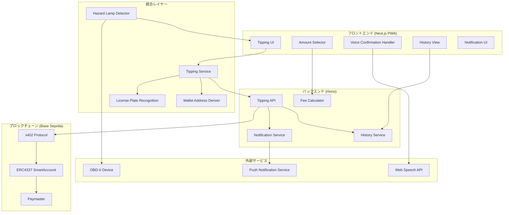
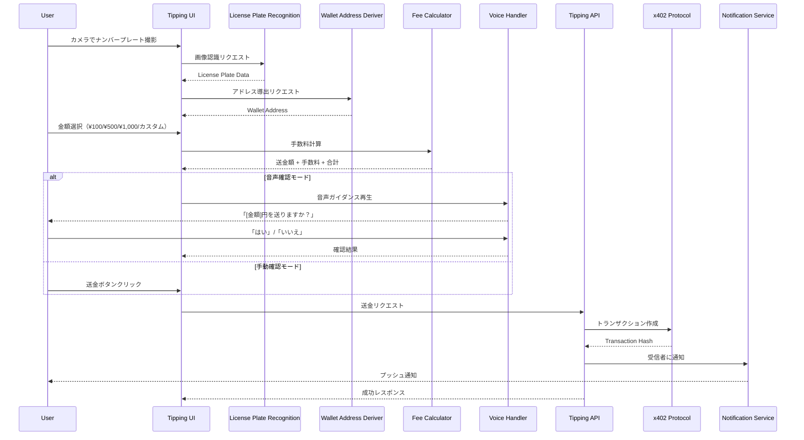

# 設計書

## 概要

本設計書は、チップ機能（P2P投げ銭）の技術的な実装方針を定義します。この機能は、ナンバープレート認識機能とウォレットアドレス変換機能を統合し、x402決済プロトコルを使用してBase L2ブロックチェーン上で車両間のP2P決済を実現するシステムを構築します。

### 設計目標

- ナンバープレート認識からトランザクション完了まで10秒以内
- 2%の手数料計算の正確性
- ハザードランプ連動による安全な自動トリガー
- 音声確認によるハンズフリー操作
- プライバシー保護（ナンバープレートの部分マスク）
- PWAプッシュ通知による受信通知

## アーキテクチャ

### システム構成図



### データフロー



## コンポーネントとインターフェース

### フロントエンドコンポーネント

#### TippingService

投げ銭機能のメインサービス。

```typescript
// pkgs/frontend/lib/tipping/tipping-service.ts

interface TippingServiceConfig {
  apiBaseUrl: string;
  maxDailyLimit: number;      // デフォルト: 50000 (¥50,000)
  minTransactionInterval: number; // デフォルト: 30000 (30秒)
}

interface TipRequest {
  recipientPlate: LicensePlateData;
  recipientAddress: `0x${string}`;
  amount: number;             // 円
  fee: number;                // 円
  message?: string;
}

interface TipResult {
  success: boolean;
  transactionHash?: `0x${string}`;
  error?: TipError;
}

interface TipError {
  code: TipErrorCode;
  message: string;
  suggestion: string;
}

type TipErrorCode =
  | 'PLATE_NOT_RECOGNIZED'
  | 'WALLET_NOT_REGISTERED'
  | 'INSUFFICIENT_BALANCE'
  | 'DAILY_LIMIT_EXCEEDED'
  | 'RATE_LIMITED'
  | 'NETWORK_ERROR'
  | 'TRANSACTION_FAILED'
  | 'TRANSACTION_TIMEOUT'
  | 'USER_CANCELLED';

class TippingService {
  constructor(config: TippingServiceConfig);

  async recognizeRecipient(image: string): Promise<RecipientInfo>;
  async sendTip(request: TipRequest): Promise<TipResult>;
  async getHistory(filter?: HistoryFilter): Promise<TipHistory[]>;
  getDailySpent(): number;
  canSendTip(): boolean;
}
```

#### TipAmountSelector

金額選択UIコンポーネント。

```typescript
// pkgs/frontend/components/tipping/TipAmountSelector.tsx

interface TipAmountSelectorProps {
  onAmountSelect: (amount: number, fee: number, total: number) => void;
  onError: (error: string) => void;
  exchangeRate: number;       // JPY to USDC
}

interface AmountBreakdown {
  amount: number;             // 送金額（円）
  fee: number;                // 手数料（円）
  total: number;              // 合計（円）
  usdcEquivalent: number;     // USDC相当額
}

const PRESET_AMOUNTS = [100, 500, 1000] as const;
const MIN_AMOUNT = 10;
const MAX_AMOUNT = 100000;
const FEE_RATE = 0.02;        // 2%
const MIN_FEE = 1;            // 最小手数料¥1
```

#### VoiceConfirmationHandler

音声確認処理コンポーネント。

```typescript
// pkgs/frontend/lib/tipping/voice-confirmation.ts

interface VoiceConfirmationConfig {
  timeout: number;            // デフォルト: 10000 (10秒)
  language: string;           // デフォルト: 'ja-JP'
}

interface VoiceConfirmationResult {
  confirmed: boolean;
  cancelled: boolean;
  timedOut: boolean;
  transcript?: string;
}

const CONFIRM_PHRASES = ['はい', '送る', 'OK', 'オーケー', '送って'];
const CANCEL_PHRASES = ['いいえ', 'キャンセル', 'やめる', '止める'];

class VoiceConfirmationHandler {
  constructor(config: VoiceConfirmationConfig);

  async requestConfirmation(amount: number): Promise<VoiceConfirmationResult>;
  speak(text: string): Promise<void>;
  startListening(): void;
  stopListening(): void;
}
```

#### HazardLampDetector

ハザードランプ検知コンポーネント。

```typescript
// pkgs/frontend/lib/tipping/hazard-detector.ts

interface HazardDetectorConfig {
  detectionWindow: number;    // デフォルト: 5000 (5秒)
  requiredFlashes: number;    // デフォルト: 2
  enabled: boolean;
}

interface HazardEvent {
  timestamp: number;
  flashCount: number;
}

class HazardLampDetector {
  constructor(config: HazardDetectorConfig);

  async connect(): Promise<boolean>;
  disconnect(): void;
  isConnected(): boolean;
  onTrigger(callback: () => void): void;
  setEnabled(enabled: boolean): void;
}
```

### バックエンドAPI

#### Tipping API Endpoints

```typescript
// pkgs/x402server/src/routes/tipping.ts

// POST /api/tipping/send
interface SendTipRequest {
  senderAddress: `0x${string}`;
  recipientAddress: `0x${string}`;
  amount: number;             // 円
  fee: number;                // 円
  senderPlateHash: string;    // プライバシー保護用ハッシュ
  recipientPlateHash: string;
  message?: string;
}

interface SendTipResponse {
  success: boolean;
  transactionHash?: `0x${string}`;
  error?: {
    code: string;
    message: string;
  };
}

// GET /api/tipping/history
interface HistoryQuery {
  address: `0x${string}`;
  type?: 'sent' | 'received' | 'all';
  startDate?: string;
  endDate?: string;
  limit?: number;
  offset?: number;
}

interface HistoryResponse {
  tips: TipHistoryItem[];
  total: number;
  hasMore: boolean;
}

// POST /api/tipping/notify
interface NotifyRequest {
  recipientAddress: `0x${string}`;
  amount: number;
  senderPlateMasked: string;  // 例: 品川330あ****
  transactionHash: `0x${string}`;
}
```

#### FeeCalculator

```typescript
// pkgs/x402server/src/lib/fee-calculator.ts

interface FeeCalculation {
  amount: number;
  fee: number;
  total: number;
  platformFee: number;
}

const FEE_RATE = 0.02;
const MIN_FEE = 1;
const PLATFORM_WALLET = process.env.PLATFORM_WALLET as `0x${string}`;

function calculateFee(amount: number): FeeCalculation {
  const rawFee = amount * FEE_RATE;
  const fee = Math.max(Math.ceil(rawFee), MIN_FEE);
  return {
    amount,
    fee,
    total: amount + fee,
    platformFee: fee,
  };
}
```

### 共通データ型

#### TipTransaction

```typescript
// pkgs/frontend/types/tipping.ts

interface TipTransaction {
  id: string;
  transactionHash: `0x${string}`;
  senderAddress: `0x${string}`;
  recipientAddress: `0x${string}`;
  amount: number;
  fee: number;
  total: number;
  senderPlateMasked: string;
  recipientPlateMasked: string;
  message?: string;
  status: TransactionStatus;
  createdAt: number;
  confirmedAt?: number;
}

type TransactionStatus =
  | 'pending'
  | 'confirmed'
  | 'failed';
```

#### TipHistory

```typescript
// pkgs/frontend/types/tipping.ts

interface TipHistory {
  id: string;
  type: 'sent' | 'received';
  transactionHash: `0x${string}`;
  counterpartyPlateMasked: string;
  amount: number;
  fee?: number;               // 送信時のみ
  timestamp: number;
  explorerUrl: string;
}

interface HistoryFilter {
  type?: 'sent' | 'received' | 'all';
  startDate?: Date;
  endDate?: Date;
}
```

#### RecipientInfo

```typescript
// pkgs/frontend/types/tipping.ts

interface RecipientInfo {
  plateData: LicensePlateData;
  plateMasked: string;        // 例: 品川330あ****
  walletAddress: `0x${string}`;
  isRegistered: boolean;
}
```

## データモデル

### ナンバープレートマスキング

```typescript
// プライバシー保護のためのマスキングロジック
function maskLicensePlate(plate: LicensePlateData): string {
  // 一連番号を****でマスク
  return `${plate.region}${plate.classificationNumber}${plate.hiragana}****`;
}

// 例: 品川330あ1234 → 品川330あ****
```

### ローカルストレージ暗号化

```typescript
// pkgs/frontend/lib/tipping/encrypted-storage.ts

interface EncryptedHistoryStorage {
  encrypt(history: TipHistory[]): string;
  decrypt(encrypted: string): TipHistory[];
  save(history: TipHistory[]): void;
  load(): TipHistory[];
}

// AES-GCM暗号化を使用
// キーはユーザーのウォレットアドレスから派生
```

### レート制限データ

```typescript
interface RateLimitData {
  dailySpent: number;
  lastTransactionTime: number;
  transactionCount: number;
}

// ローカルストレージに保存
// 日付が変わるとリセット
```


## 正確性プロパティ

*プロパティとは、システムの全ての有効な実行において真であるべき特性や振る舞いです。プロパティは、人間が読める仕様と機械で検証可能な正確性保証の橋渡しをします。*

### Property 1: 投げ銭フロー統合

*任意の* 有効なナンバープレート画像に対して、Tipping_Serviceは以下の順序で処理を実行すること：
1. License_Plate_Recognition_Serviceを呼び出してナンバープレートを認識
2. 認識成功時、Wallet_Address_Deriverを呼び出してウォレットアドレスを取得
3. アドレス取得成功時、送金先情報（ナンバープレート表示、ウォレットアドレス）をUIに表示

**Validates: Requirements 1.1, 1.2, 1.3**

### Property 2: 金額範囲検証

*任意の* カスタム金額入力に対して、Tip_Amount_Selectorは金額が最小値（¥10）以上かつ最大値（¥100,000）以下であることを検証し、範囲外の場合はエラーを返すこと。

**Validates: Requirements 2.3**

### Property 3: 手数料計算の正確性

*任意の* 有効な送金額に対して、Fee_Calculatorは以下の条件を満たす手数料を計算すること：
1. 手数料 = ceil(金額 × 0.02)
2. 手数料 >= ¥1（最小手数料）
3. 合計 = 金額 + 手数料

**Validates: Requirements 3.1, 3.2, 3.4**

### Property 4: トランザクションハッシュの返却

*任意の* 成功したトランザクションに対して、Transaction_Executorは有効なトランザクションハッシュ（0x + 64桁の16進数）を返すこと。

**Validates: Requirements 4.4**

### Property 5: 通知のプライバシーマスキング

*任意の* 投げ銭通知に対して、Notification_Serviceは送信者のナンバープレートを部分マスク形式（例：品川330あ****）で表示し、一連番号を公開しないこと。

**Validates: Requirements 5.6**

### Property 6: ハザードランプ検知タイミング

*任意の* ハザードランプ点灯イベントに対して、Hazard_Lamp_Detectorは5秒以内に2回の点灯を検知した場合にのみ投げ銭画面をトリガーすること。5秒を超えた場合はカウントをリセットすること。

**Validates: Requirements 6.2, 6.3**

### Property 7: 音声コマンド認識

*任意の* 音声入力に対して、Voice_Confirmation_Handlerは以下の動作を行うこと：
1. 確認フレーズ（「はい」「送る」「OK」）を認識した場合、投げ銭を実行
2. キャンセルフレーズ（「いいえ」「キャンセル」）を認識した場合、投げ銭をキャンセル

**Validates: Requirements 7.3, 7.4**

### Property 8: 音声タイムアウト動作

*任意の* 音声確認セッションに対して、Voice_Confirmation_Handlerは10秒のタイムアウト後に自動的にキャンセル処理を実行すること。

**Validates: Requirements 7.7, 7.8**

### Property 9: 履歴データ構造の完全性

*任意の* 保存された投げ銭履歴に対して、TipHistoryは以下の全フィールドを含むこと：
- id, type, transactionHash, counterpartyPlateMasked, amount, timestamp, explorerUrl
また、履歴は最新のものから時系列順（降順）でソートされていること。

**Validates: Requirements 8.3, 8.4**

### Property 10: レート制限の適用

*任意の* 送金リクエストに対して、Tipping_Serviceは以下のレート制限を適用すること：
1. 1日あたりの送金合計が上限（デフォルト¥50,000）を超えない
2. 連続送金の間隔が最低30秒以上

**Validates: Requirements 9.2, 9.3**

### Property 11: エラーレスポンス構造

*任意の* エラーが発生した場合、Tipping_Serviceはcode、message、suggestionの全フィールドを含むエラーレスポンスを返すこと。

**Validates: Requirements 10.4**

### Property 12: リトライメカニズム

*任意の* 失敗したトランザクションに対して、Tipping_Serviceは最大3回の自動リトライを実行し、全て失敗した場合にのみエラーを返すこと。

**Validates: Requirements 10.6**

## エラーハンドリング

### エラーコード一覧

| エラーコード | 説明 | 推奨アクション |
|------------|------|--------------|
| `PLATE_NOT_RECOGNIZED` | ナンバープレートが認識できない | カメラをナンバープレートに向けて再撮影してください |
| `WALLET_NOT_REGISTERED` | 車両がシステムに未登録 | この車両はシステムに登録されていません |
| `INSUFFICIENT_BALANCE` | 残高不足 | ウォレットに残高を追加してください |
| `DAILY_LIMIT_EXCEEDED` | 1日の送金上限超過 | 明日以降に再試行してください |
| `RATE_LIMITED` | 連続送金制限 | 30秒後に再試行してください |
| `NETWORK_ERROR` | ネットワーク接続エラー | ネットワーク接続を確認してください |
| `TRANSACTION_FAILED` | トランザクション失敗 | 再試行してください |
| `TRANSACTION_TIMEOUT` | トランザクションタイムアウト | ネットワーク接続を確認して再試行してください |
| `USER_CANCELLED` | ユーザーによるキャンセル | - |
| `VOICE_NOT_RECOGNIZED` | 音声が認識できない | もう一度お話しください |
| `VOICE_TIMEOUT` | 音声確認タイムアウト | 再度投げ銭を開始してください |

### リトライ戦略

```typescript
const RETRY_CONFIG = {
  maxRetries: 3,
  initialDelay: 1000,  // ms
  maxDelay: 5000,      // ms
  backoffMultiplier: 2,
};

async function withRetry<T>(
  fn: () => Promise<T>,
  config = RETRY_CONFIG
): Promise<T> {
  let lastError: Error;
  let delay = config.initialDelay;

  for (let attempt = 0; attempt <= config.maxRetries; attempt++) {
    try {
      return await fn();
    } catch (error) {
      lastError = error as Error;
      if (attempt < config.maxRetries) {
        await sleep(delay);
        delay = Math.min(delay * config.backoffMultiplier, config.maxDelay);
      }
    }
  }

  throw lastError!;
}
```

### タイムアウト設定

```typescript
const TIMEOUT_CONFIG = {
  plateRecognition: 5000,     // ナンバープレート認識: 5秒
  addressDerivation: 3000,    // アドレス導出: 3秒
  transaction: 30000,         // トランザクション: 30秒
  voiceConfirmation: 10000,   // 音声確認: 10秒
  notification: 5000,         // 通知送信: 5秒
};
```

## テスト戦略

### テストフレームワーク

- **フロントエンド**: Vitest + React Testing Library + fast-check
- **バックエンド**: Vitest + fast-check
- **E2E**: Playwright

### ユニットテスト

#### FeeCalculator

```typescript
// pkgs/x402server/__tests__/tipping/fee-calculator.test.ts

describe('FeeCalculator', () => {
  it('should calculate 2% fee for ¥1000', () => {
    const result = calculateFee(1000);
    expect(result.fee).toBe(20);
    expect(result.total).toBe(1020);
  });

  it('should apply minimum fee of ¥1', () => {
    const result = calculateFee(10);
    // 10 * 0.02 = 0.2 → ceil → 1
    expect(result.fee).toBe(1);
    expect(result.total).toBe(11);
  });

  it('should ceil fractional fees', () => {
    const result = calculateFee(150);
    // 150 * 0.02 = 3 → ceil → 3
    expect(result.fee).toBe(3);
    expect(result.total).toBe(153);
  });
});
```

#### VoiceConfirmationHandler

```typescript
// pkgs/frontend/__tests__/tipping/voice-confirmation.test.ts

describe('VoiceConfirmationHandler', () => {
  it('should confirm on "はい"', async () => {
    const handler = new VoiceConfirmationHandler({ timeout: 10000 });
    mockSpeechRecognition('はい');
    const result = await handler.requestConfirmation(500);
    expect(result.confirmed).toBe(true);
  });

  it('should cancel on "キャンセル"', async () => {
    const handler = new VoiceConfirmationHandler({ timeout: 10000 });
    mockSpeechRecognition('キャンセル');
    const result = await handler.requestConfirmation(500);
    expect(result.cancelled).toBe(true);
  });

  it('should timeout after 10 seconds', async () => {
    const handler = new VoiceConfirmationHandler({ timeout: 10000 });
    mockSpeechRecognitionTimeout();
    const result = await handler.requestConfirmation(500);
    expect(result.timedOut).toBe(true);
  });
});
```

### プロパティベーステスト

```typescript
// pkgs/x402server/__tests__/tipping/fee-calculator.property.test.ts
import * as fc from 'fast-check';

describe('FeeCalculator Properties', () => {
  // Feature: tipping-feature, Property 3: 手数料計算の正確性
  it('should always calculate fee as ceil(amount * 0.02) with minimum ¥1', () => {
    fc.assert(
      fc.property(
        fc.integer({ min: 10, max: 100000 }),
        (amount) => {
          const result = calculateFee(amount);
          const expectedFee = Math.max(Math.ceil(amount * 0.02), 1);
          return (
            result.fee === expectedFee &&
            result.total === amount + result.fee &&
            result.fee >= 1
          );
        }
      ),
      { numRuns: 100 }
    );
  });
});
```

```typescript
// pkgs/frontend/__tests__/tipping/amount-selector.property.test.ts
import * as fc from 'fast-check';

describe('TipAmountSelector Properties', () => {
  // Feature: tipping-feature, Property 2: 金額範囲検証
  it('should validate amount within range', () => {
    fc.assert(
      fc.property(
        fc.integer({ min: -1000, max: 200000 }),
        (amount) => {
          const result = validateAmount(amount);
          if (amount >= 10 && amount <= 100000) {
            return result.isValid === true;
          } else {
            return result.isValid === false && result.error !== undefined;
          }
        }
      ),
      { numRuns: 100 }
    );
  });
});
```

```typescript
// pkgs/frontend/__tests__/tipping/privacy.property.test.ts
import * as fc from 'fast-check';

describe('Privacy Properties', () => {
  // Feature: tipping-feature, Property 5: 通知のプライバシーマスキング
  it('should mask serial number in license plate', () => {
    fc.assert(
      fc.property(
        validLicensePlateDataArbitrary(),
        (plate) => {
          const masked = maskLicensePlate(plate);
          // マスクされた文字列は一連番号を含まない
          return (
            masked.includes(plate.region) &&
            masked.includes(plate.classificationNumber) &&
            masked.includes(plate.hiragana) &&
            masked.includes('****') &&
            !masked.includes(plate.serialNumber)
          );
        }
      ),
      { numRuns: 100 }
    );
  });
});
```

```typescript
// pkgs/frontend/__tests__/tipping/rate-limit.property.test.ts
import * as fc from 'fast-check';

describe('Rate Limiting Properties', () => {
  // Feature: tipping-feature, Property 10: レート制限の適用
  it('should enforce daily limit', () => {
    fc.assert(
      fc.property(
        fc.array(fc.integer({ min: 10, max: 10000 }), { minLength: 1, maxLength: 20 }),
        (amounts) => {
          const service = new TippingService({ maxDailyLimit: 50000 });
          let totalSpent = 0;

          for (const amount of amounts) {
            const canSend = service.canSendTip();
            if (totalSpent + amount <= 50000) {
              // 上限内なら送金可能
              if (canSend) {
                service.recordTransaction(amount);
                totalSpent += amount;
              }
            } else {
              // 上限超過なら送金不可
              return !canSend || service.getDailySpent() <= 50000;
            }
          }
          return service.getDailySpent() <= 50000;
        }
      ),
      { numRuns: 100 }
    );
  });

  it('should enforce minimum interval between transactions', () => {
    fc.assert(
      fc.property(
        fc.array(fc.integer({ min: 0, max: 60000 }), { minLength: 2, maxLength: 10 }),
        (intervals) => {
          const service = new TippingService({ minTransactionInterval: 30000 });
          let lastTime = 0;

          for (const interval of intervals) {
            const currentTime = lastTime + interval;
            const canSend = service.canSendTipAt(currentTime);

            if (interval < 30000 && lastTime > 0) {
              // 30秒未満なら送金不可
              if (canSend) return false;
            }

            if (canSend) {
              lastTime = currentTime;
            }
          }
          return true;
        }
      ),
      { numRuns: 100 }
    );
  });
});
```

```typescript
// pkgs/frontend/__tests__/tipping/voice-confirmation.property.test.ts
import * as fc from 'fast-check';

describe('Voice Confirmation Properties', () => {
  // Feature: tipping-feature, Property 7: 音声コマンド認識
  it('should recognize confirm and cancel phrases correctly', () => {
    const confirmPhrases = ['はい', '送る', 'OK', 'オーケー', '送って'];
    const cancelPhrases = ['いいえ', 'キャンセル', 'やめる', '止める'];

    fc.assert(
      fc.property(
        fc.oneof(
          fc.constantFrom(...confirmPhrases),
          fc.constantFrom(...cancelPhrases)
        ),
        (phrase) => {
          const result = parseVoiceCommand(phrase);
          if (confirmPhrases.includes(phrase)) {
            return result.action === 'confirm';
          } else {
            return result.action === 'cancel';
          }
        }
      ),
      { numRuns: 100 }
    );
  });
});
```

```typescript
// pkgs/frontend/__tests__/tipping/history.property.test.ts
import * as fc from 'fast-check';

describe('History Properties', () => {
  // Feature: tipping-feature, Property 9: 履歴データ構造の完全性
  it('should have complete history data structure', () => {
    fc.assert(
      fc.property(
        tipHistoryArbitrary(),
        (history) => {
          return (
            typeof history.id === 'string' &&
            (history.type === 'sent' || history.type === 'received') &&
            /^0x[0-9a-f]{64}$/i.test(history.transactionHash) &&
            typeof history.counterpartyPlateMasked === 'string' &&
            history.counterpartyPlateMasked.includes('****') &&
            typeof history.amount === 'number' &&
            history.amount > 0 &&
            typeof history.timestamp === 'number' &&
            typeof history.explorerUrl === 'string'
          );
        }
      ),
      { numRuns: 100 }
    );
  });

  it('should sort history by timestamp descending', () => {
    fc.assert(
      fc.property(
        fc.array(tipHistoryArbitrary(), { minLength: 2, maxLength: 20 }),
        (histories) => {
          const sorted = sortHistoryByTimestamp(histories);
          for (let i = 1; i < sorted.length; i++) {
            if (sorted[i - 1].timestamp < sorted[i].timestamp) {
              return false;
            }
          }
          return true;
        }
      ),
      { numRuns: 100 }
    );
  });
});
```

### テストデータ生成

```typescript
// pkgs/frontend/__tests__/arbitraries/tipping.ts
import * as fc from 'fast-check';

export const tipHistoryArbitrary = () =>
  fc.record({
    id: fc.uuid(),
    type: fc.constantFrom('sent', 'received'),
    transactionHash: fc.hexaString({ minLength: 64, maxLength: 64 }).map(h => `0x${h}` as `0x${string}`),
    counterpartyPlateMasked: fc.constantFrom(
      '品川330あ****',
      '横浜500か****',
      '名古屋300さ****'
    ),
    amount: fc.integer({ min: 10, max: 100000 }),
    timestamp: fc.integer({ min: 1700000000000, max: 1800000000000 }),
    explorerUrl: fc.constant('https://sepolia.basescan.org/tx/'),
  }).map(h => ({
    ...h,
    explorerUrl: `${h.explorerUrl}${h.transactionHash}`,
  }));

export const validLicensePlateDataArbitrary = () =>
  fc.record({
    region: fc.constantFrom('品川', '横浜', '名古屋', '大阪', '神戸'),
    classificationNumber: fc.stringOf(
      fc.constantFrom('0', '1', '2', '3', '4', '5', '6', '7', '8', '9'),
      { minLength: 3, maxLength: 3 }
    ),
    hiragana: fc.constantFrom('あ', 'い', 'う', 'え', 'お', 'か', 'き', 'く'),
    serialNumber: fc.stringOf(
      fc.constantFrom('0', '1', '2', '3', '4', '5', '6', '7', '8', '9'),
      { minLength: 1, maxLength: 4 }
    ),
  });
```

### テストカバレッジ目標

- ユニットテスト: 80%以上
- プロパティテスト: 全ての正確性プロパティをカバー
- E2Eテスト: 主要なユーザーフローをカバー
