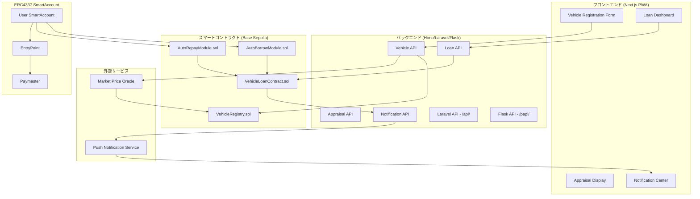
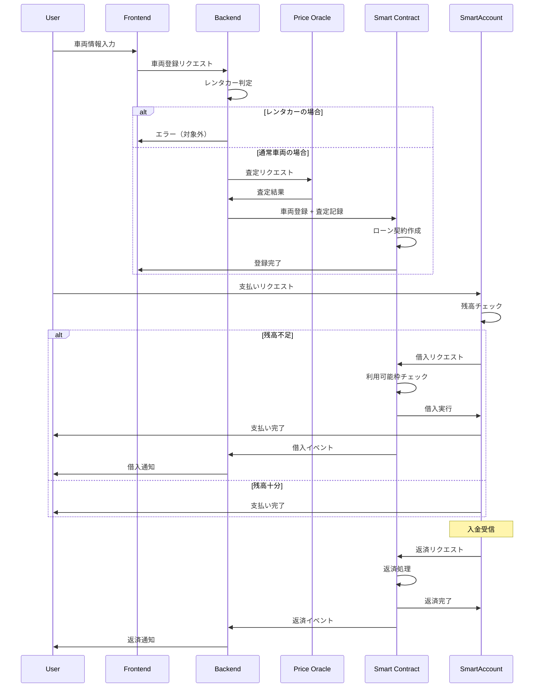

# 設計書

## 概要

本設計書は、車両価値トークン化機能（車担保自動ローン）の技術的な実装方針を定義します。この機能は、車両の査定価値を担保としてオンチェーンでローン契約を管理し、ウォレット残高不足時の自動借入と収益からの自動返済を実現するシステムを構築します。

### 設計目標

- 車両価値の正確な査定と担保化
- ERC4337 SmartAccountとの完全な統合
- 自動借入・自動返済のシームレスな実行
- レンタカーナンバーの確実な除外
- リアルタイムな残高・ローン状態の表示
- 透明性のある金利・手数料計算

## アーキテクチャ

### システム構成図



### データフロー



## コンポーネントとインターフェース

### フロントエンドコンポーネント

#### VehicleRegistrationService

車両登録を管理するサービス。

```typescript
// pkgs/frontend/lib/loan/vehicle-registration.ts

interface VehicleData {
  licensePlate: LicensePlateData;  // wallet-address-conversionから
  make: string;                     // メーカー（例：トヨタ）
  model: string;                    // 車種（例：プリウス）
  year: number;                     // 年式（例：2020）
  mileage: number;                  // 走行距離（km）
}

interface RegistrationResult {
  success: boolean;
  vehicleId?: string;
  appraisalResult?: AppraisalResult;
  creditLimit?: bigint;
  error?: RegistrationError;
}

interface RegistrationError {
  code: 'RENTAL_PLATE' | 'DUPLICATE_VEHICLE' | 'INVALID_DATA' | 'APPRAISAL_FAILED' | 'CONTRACT_FAILED';
  message: string;
}

class VehicleRegistrationService {
  async registerVehicle(data: VehicleData): Promise<RegistrationResult>;
  async isRentalPlate(hiragana: string): boolean;
  async checkDuplicate(licensePlate: LicensePlateData): Promise<boolean>;
}
```

#### AppraisalService

車両査定を管理するサービス。

```typescript
// pkgs/frontend/lib/loan/appraisal-service.ts

interface AppraisalResult {
  appraisedValue: bigint;           // 査定額（wei）
  appraisedAt: number;              // 査定日時（Unix timestamp）
  expiresAt: number;                // 有効期限（Unix timestamp）
  source: 'AI' | 'ORACLE' | 'MANUAL';
}

interface AppraisalError {
  code: 'API_ERROR' | 'INVALID_VEHICLE' | 'TIMEOUT';
  message: string;
}

class AppraisalService {
  async appraise(vehicle: VehicleData): Promise<AppraisalResult>;
  async refreshAppraisal(vehicleId: string): Promise<AppraisalResult>;
  isAppraisalValid(result: AppraisalResult): boolean;
}
```

#### CreditCalculator

利用可能枠を計算するユーティリティ。

```typescript
// pkgs/frontend/lib/loan/credit-calculator.ts

const CREDIT_RATIO = 75n; // 75%
const CREDIT_RATIO_DENOMINATOR = 100n;

interface CreditInfo {
  creditLimit: bigint;              // 利用可能枠
  usedCredit: bigint;               // 使用済み枠
  availableCredit: bigint;          // 残り利用可能枠
}

function calculateCreditLimit(appraisedValue: bigint): bigint;
function calculateAvailableCredit(creditLimit: bigint, currentDebt: bigint): bigint;
```

#### LoanDashboard

ローン状態を表示するコンポーネント。

```typescript
// pkgs/frontend/lib/loan/loan-dashboard.ts

interface LoanStatus {
  vehicleId: string;
  appraisedValue: bigint;
  creditLimit: bigint;
  currentDebt: bigint;
  availableCredit: bigint;
  interestRate: number;             // 年率（例：0.04 = 4%）
  monthlyFee: bigint;               // 月額管理手数料
  accruedInterest: bigint;          // 未払い利息
  lastInterestUpdate: number;       // 最終利息計算日時
  appraisalExpiry: number;          // 査定有効期限
}

interface LoanEvent {
  type: 'BORROW' | 'REPAY' | 'INTEREST' | 'FEE';
  amount: bigint;
  timestamp: number;
  txHash: string;
}

class LoanDashboardService {
  async getLoanStatus(walletAddress: string): Promise<LoanStatus | null>;
  async getLoanHistory(walletAddress: string): Promise<LoanEvent[]>;
  subscribeToUpdates(walletAddress: string, callback: (status: LoanStatus) => void): () => void;
}
```

### バックエンドAPI

#### Vehicle API

```typescript
// pkgs/x402server/src/routes/vehicle.ts

// POST /api/vehicle/register
interface RegisterVehicleRequest {
  licensePlate: LicensePlateData;
  make: string;
  model: string;
  year: number;
  mileage: number;
  walletAddress: string;
  signature: string;  // 所有権証明
}

interface RegisterVehicleResponse {
  success: boolean;
  vehicleId?: string;
  appraisalResult?: AppraisalResult;
  creditLimit?: string;  // bigint as string
  error?: string;
}

// GET /api/vehicle/:vehicleId
interface GetVehicleResponse {
  vehicleId: string;
  licensePlateHash: string;
  make: string;
  model: string;
  year: number;
  mileage: number;
  appraisalResult: AppraisalResult;
  creditLimit: string;
}

// POST /api/vehicle/:vehicleId/reappraise
interface ReappraiseResponse {
  success: boolean;
  appraisalResult?: AppraisalResult;
  newCreditLimit?: string;
  error?: string;
}
```

#### Loan API

```typescript
// pkgs/x402server/src/routes/loan.ts

// GET /api/loan/:walletAddress
interface GetLoanStatusResponse {
  hasLoan: boolean;
  status?: LoanStatus;
}

// GET /api/loan/:walletAddress/history
interface GetLoanHistoryResponse {
  events: LoanEvent[];
  totalBorrowed: string;
  totalRepaid: string;
  totalInterest: string;
}

// POST /api/loan/:walletAddress/settings
interface UpdateLoanSettingsRequest {
  autoRepayRatio: number;  // 0-100
}
```

### スマートコントラクト

#### VehicleRegistry

```solidity
// pkgs/contract/contracts/loan/VehicleRegistry.sol

// SPDX-License-Identifier: MIT
pragma solidity ^0.8.20;

/**
 * @title VehicleRegistry
 * @notice 車両情報と査定結果を管理するコントラクト
 */
contract VehicleRegistry {
    struct Vehicle {
        bytes32 licensePlateHash;    // ナンバープレートのハッシュ
        bytes32 vehicleInfoHash;     // 車両情報のハッシュ
        address owner;               // 所有者のウォレットアドレス
        uint256 appraisedValue;      // 査定額
        uint256 appraisedAt;         // 査定日時
        uint256 appraisalExpiry;     // 査定有効期限
        bool isActive;               // アクティブフラグ
    }

    mapping(bytes32 => Vehicle) public vehicles;
    mapping(address => bytes32) public ownerToVehicle;

    event VehicleRegistered(bytes32 indexed vehicleId, address indexed owner, uint256 appraisedValue);
    event AppraisalUpdated(bytes32 indexed vehicleId, uint256 newValue, uint256 expiry);
    event VehicleDeactivated(bytes32 indexed vehicleId);

    function registerVehicle(
        bytes32 licensePlateHash,
        bytes32 vehicleInfoHash,
        uint256 appraisedValue,
        uint256 appraisalExpiry
    ) external returns (bytes32 vehicleId);

    function updateAppraisal(
        bytes32 vehicleId,
        uint256 newValue,
        uint256 newExpiry
    ) external;

    function getVehicle(bytes32 vehicleId) external view returns (Vehicle memory);

    function isAppraisalValid(bytes32 vehicleId) external view returns (bool);
}
```

#### VehicleLoanContract

```solidity
// pkgs/contract/contracts/loan/VehicleLoanContract.sol

// SPDX-License-Identifier: MIT
pragma solidity ^0.8.20;

import "./VehicleRegistry.sol";

/**
 * @title VehicleLoanContract
 * @notice 車両担保ローンを管理するコントラクト
 */
contract VehicleLoanContract {
    uint256 public constant CREDIT_RATIO = 75;  // 75%
    uint256 public constant CREDIT_RATIO_DENOMINATOR = 100;
    uint256 public constant INTEREST_RATE_DENOMINATOR = 10000;  // 0.01% precision
    uint256 public constant SECONDS_PER_YEAR = 365 days;

    struct Loan {
        bytes32 vehicleId;
        address borrower;
        uint256 creditLimit;
        uint256 currentDebt;
        uint256 interestRate;        // 年率（basis points, e.g., 400 = 4%）
        uint256 monthlyFee;          // 月額管理手数料
        uint256 accruedInterest;
        uint256 lastInterestUpdate;
        uint256 autoRepayRatio;      // 自動返済割合（0-100）
        bool isActive;
    }

    VehicleRegistry public vehicleRegistry;
    mapping(address => Loan) public loans;

    event LoanCreated(address indexed borrower, bytes32 indexed vehicleId, uint256 creditLimit);
    event Borrowed(address indexed borrower, uint256 amount, uint256 newDebt);
    event Repaid(address indexed borrower, uint256 amount, uint256 remainingDebt);
    event InterestAccrued(address indexed borrower, uint256 interest, uint256 newDebt);
    event FeeCharged(address indexed borrower, uint256 fee);
    event LoanClosed(address indexed borrower);

    function createLoan(
        bytes32 vehicleId,
        uint256 interestRate,
        uint256 monthlyFee
    ) external returns (bool);

    function borrow(uint256 amount) external returns (bool);

    function repay(uint256 amount) external returns (bool);

    function accrueInterest(address borrower) external;

    function chargeFee(address borrower) external;

    function getCreditLimit(address borrower) external view returns (uint256);

    function getAvailableCredit(address borrower) external view returns (uint256);

    function getLoanStatus(address borrower) external view returns (Loan memory);

    function calculateInterest(address borrower) public view returns (uint256);
}
```

#### AutoBorrowModule

```solidity
// pkgs/contract/contracts/loan/AutoBorrowModule.sol

// SPDX-License-Identifier: MIT
pragma solidity ^0.8.20;

import "./VehicleLoanContract.sol";
import "@account-abstraction/contracts/interfaces/IAccount.sol";

/**
 * @title AutoBorrowModule
 * @notice SmartAccountの残高不足時に自動借入を実行するモジュール
 */
contract AutoBorrowModule {
    VehicleLoanContract public loanContract;

    event AutoBorrowExecuted(address indexed account, uint256 amount, uint256 shortfall);
    event AutoBorrowFailed(address indexed account, uint256 shortfall, string reason);

    function executeAutoBorrow(
        address account,
        uint256 requiredAmount,
        uint256 currentBalance
    ) external returns (bool);

    function checkAndBorrow(
        address account,
        uint256 requiredAmount
    ) external returns (uint256 borrowedAmount);
}
```

#### AutoRepayModule

```solidity
// pkgs/contract/contracts/loan/AutoRepayModule.sol

// SPDX-License-Identifier: MIT
pragma solidity ^0.8.20;

import "./VehicleLoanContract.sol";

/**
 * @title AutoRepayModule
 * @notice 入金時に自動返済を実行するモジュール
 */
contract AutoRepayModule {
    VehicleLoanContract public loanContract;

    event AutoRepayExecuted(address indexed account, uint256 amount, uint256 remainingDebt);
    event AutoRepaySkipped(address indexed account, string reason);

    function executeAutoRepay(
        address account,
        uint256 incomingAmount
    ) external returns (uint256 repaidAmount);

    function calculateRepayAmount(
        address account,
        uint256 incomingAmount
    ) external view returns (uint256);
}
```

## データモデル

### 車両情報のハッシュ化

```typescript
// 車両情報のハッシュ化仕様

interface VehicleInfoForHash {
  make: string;
  model: string;
  year: number;
  mileage: number;
}

// keccak256(abi.encodePacked(make, model, year, mileage))
function hashVehicleInfo(info: VehicleInfoForHash): `0x${string}` {
  return keccak256(
    encodePacked(
      ['string', 'string', 'uint256', 'uint256'],
      [info.make, info.model, BigInt(info.year), BigInt(info.mileage)]
    )
  );
}
```

### 金利計算ロジック

```typescript
// 金利計算仕様

const SECONDS_PER_YEAR = 365n * 24n * 60n * 60n;
const INTEREST_RATE_DENOMINATOR = 10000n;  // basis points

// 日割り金利計算
function calculateAccruedInterest(
  principal: bigint,
  interestRateBps: bigint,  // basis points (e.g., 400 = 4%)
  secondsElapsed: bigint
): bigint {
  return (principal * interestRateBps * secondsElapsed) /
         (INTEREST_RATE_DENOMINATOR * SECONDS_PER_YEAR);
}

// 例: 100万円、年率4%、30日経過
// = (1000000 * 400 * 2592000) / (10000 * 31536000)
// = 約3,287円
```

### レンタカー判定ロジック

```typescript
// レンタカー・カーシェアナンバーの判定
const RENTAL_HIRAGANA = ['わ', 'れ'];

function isRentalPlate(hiragana: string): boolean {
  return RENTAL_HIRAGANA.includes(hiragana);
}
```


## 正確性プロパティ

*プロパティとは、システムの全ての有効な実行において真であるべき特性や振る舞いです。プロパティは、人間が読める仕様と機械で検証可能な正確性保証の橋渡しをします。*

### Property 1: レンタカーナンバーの検出と除外

*任意の* ナンバープレートデータに対して、ひらがなが「わ」または「れ」の場合にのみRental_Plate_Filterは車両登録を拒否し、それ以外のひらがなでは登録を許可すること。

**Validates: Requirements 2.1**

### Property 2: 車両登録の重複防止

*任意の* 有効な車両データに対して、同一のナンバープレートで2回目の登録を試みた場合、Vehicle_Registryは重複エラーを返し、最初の登録データは変更されないこと。

**Validates: Requirements 1.3**

### Property 3: 利用可能枠の計算正確性

*任意の* 有効な査定額に対して、Credit_Calculatorは査定額の正確に75%を利用可能枠として計算し、既存の借入残高を差し引いた額を実際に借入可能な額として返すこと。

**Validates: Requirements 4.1, 4.2, 4.3**

### Property 4: 自動借入の正確性

*任意の* 支払いリクエストに対して、ウォレット残高が不足している場合、Auto_Borrow_Handlerは不足分を借入し、借入後の債務は借入前の債務に借入額を加算した値と等しくなること。ただし、借入額が利用可能枠を超える場合は取引を拒否すること。

**Validates: Requirements 6.1, 6.2, 6.3, 6.5**

### Property 5: 自動返済の正確性

*任意の* 入金に対して、借入残高がある場合、Auto_Repay_Handlerは入金額の設定割合を返済に充て、返済後の債務は返済前の債務から返済額を差し引いた値と等しくなること。

**Validates: Requirements 7.1, 7.2, 7.4**

### Property 6: 金利計算の正確性

*任意の* ローン契約に対して、金利は元本 × 年率 × 経過日数 / 365日の公式に従って計算され、計算結果は借入残高に加算されること。

**Validates: Requirements 8.1, 8.3**

### Property 7: 査定有効期限の管理

*任意の* 車両査定に対して、査定日から30日後に有効期限が設定され、有効期限切れ後は借入操作が拒否され再査定が要求されること。

**Validates: Requirements 3.2, 3.5**

### Property 8: ローン状態の一貫性

*任意の* 借入・返済操作に対して、操作後のローン状態（債務残高、利用可能枠）は操作前の状態と操作内容から決定論的に計算可能であり、対応するイベントが発行されること。

**Validates: Requirements 6.4, 7.3, 8.5**

### Property 9: 車両情報のハッシュ化保存

*任意の* 登録された車両に対して、オンチェーンに保存されるのは車両情報のハッシュのみであり、元の車両情報（メーカー、車種等）は直接保存されないこと。

**Validates: Requirements 11.1**

### Property 10: アクセス制御の正確性

*任意の* ローン操作に対して、車両所有者のウォレットアドレスからのみ借入・返済・設定変更が可能であり、他のアドレスからの操作は拒否されること。

**Validates: Requirements 11.3, 11.4**

## エラーハンドリング

### エラーコード一覧

| エラーコード | 説明 | 推奨アクション |
|------------|------|--------------|
| `RENTAL_PLATE` | レンタカー・カーシェアナンバー | 自己所有車両で登録してください |
| `DUPLICATE_VEHICLE` | 車両が既に登録済み | 既存の登録を確認してください |
| `INVALID_DATA` | 無効な車両情報 | 入力内容を確認してください |
| `APPRAISAL_FAILED` | 査定に失敗 | 再試行してください |
| `APPRAISAL_EXPIRED` | 査定有効期限切れ | 再査定を実行してください |
| `CONTRACT_FAILED` | コントラクト操作失敗 | 再試行してください |
| `INSUFFICIENT_CREDIT` | 利用可能枠不足 | 返済後に再試行してください |
| `UNAUTHORIZED` | 権限なし | 車両所有者でログインしてください |
| `LOAN_NOT_FOUND` | ローン契約なし | 車両を登録してください |

### リトライ戦略

```typescript
const RETRY_CONFIG = {
  appraisal: {
    maxRetries: 3,
    initialDelay: 1000,
    maxDelay: 5000,
  },
  contractCall: {
    maxRetries: 3,
    initialDelay: 1000,
    maxDelay: 5000,
  },
  notification: {
    maxRetries: 5,
    initialDelay: 500,
    maxDelay: 10000,
  },
};
```

## テスト戦略

### テストフレームワーク

- **フロントエンド**: Vitest + fast-check（プロパティベーステスト）
- **バックエンド**: Vitest + fast-check
- **コントラクト**: Hardhat Test + fast-check

### ユニットテスト

#### Rental Plate Filter

```typescript
// pkgs/frontend/__tests__/loan/rental-filter.test.ts

describe('RentalPlateFilter', () => {
  it('should reject "わ" plate', () => {
    expect(isRentalPlate('わ')).toBe(true);
  });

  it('should reject "れ" plate', () => {
    expect(isRentalPlate('れ')).toBe(true);
  });

  it('should accept normal plate', () => {
    expect(isRentalPlate('あ')).toBe(false);
  });
});
```

#### Credit Calculator

```typescript
// pkgs/frontend/__tests__/loan/credit-calculator.test.ts

describe('CreditCalculator', () => {
  it('should calculate 75% of appraised value', () => {
    const appraisedValue = 1000000n;
    const creditLimit = calculateCreditLimit(appraisedValue);
    expect(creditLimit).toBe(750000n);
  });

  it('should calculate available credit correctly', () => {
    const creditLimit = 750000n;
    const currentDebt = 200000n;
    const available = calculateAvailableCredit(creditLimit, currentDebt);
    expect(available).toBe(550000n);
  });
});
```

### プロパティベーステスト

```typescript
// pkgs/frontend/__tests__/loan/rental-filter.property.test.ts
import * as fc from 'fast-check';

describe('RentalPlateFilter Properties', () => {
  // Feature: vehicle-value-tokenization, Property 1: レンタカーナンバーの検出と除外
  it('should only reject わ and れ plates', () => {
    const HIRAGANA = ['あ', 'い', 'う', 'え', 'お', 'か', 'き', 'く', 'け', 'こ',
                      'さ', 'し', 'す', 'せ', 'そ', 'た', 'ち', 'つ', 'て', 'と',
                      'な', 'に', 'ぬ', 'ね', 'の', 'は', 'ひ', 'ふ', 'へ', 'ほ',
                      'ま', 'み', 'む', 'め', 'も', 'や', 'ゆ', 'よ',
                      'ら', 'り', 'る', 'れ', 'ろ', 'わ', 'を', 'ん'];

    fc.assert(
      fc.property(
        fc.constantFrom(...HIRAGANA),
        (hiragana) => {
          const isRental = isRentalPlate(hiragana);
          const expectedRental = hiragana === 'わ' || hiragana === 'れ';
          return isRental === expectedRental;
        }
      ),
      { numRuns: 100 }
    );
  });
});
```

```typescript
// pkgs/frontend/__tests__/loan/credit-calculator.property.test.ts
import * as fc from 'fast-check';

describe('CreditCalculator Properties', () => {
  // Feature: vehicle-value-tokenization, Property 3: 利用可能枠の計算正確性
  it('should calculate credit limit as exactly 75% of appraised value', () => {
    fc.assert(
      fc.property(
        fc.bigInt({ min: 1n, max: 10n ** 18n }),  // 1 wei to 1 ETH
        (appraisedValue) => {
          const creditLimit = calculateCreditLimit(appraisedValue);
          const expected = (appraisedValue * 75n) / 100n;
          return creditLimit === expected;
        }
      ),
      { numRuns: 100 }
    );
  });

  it('should calculate available credit correctly', () => {
    fc.assert(
      fc.property(
        fc.bigInt({ min: 1n, max: 10n ** 18n }),
        fc.bigInt({ min: 0n, max: 10n ** 18n }),
        (creditLimit, currentDebt) => {
          if (currentDebt > creditLimit) return true;  // Skip invalid cases
          const available = calculateAvailableCredit(creditLimit, currentDebt);
          return available === creditLimit - currentDebt;
        }
      ),
      { numRuns: 100 }
    );
  });
});
```

```typescript
// pkgs/frontend/__tests__/loan/interest-calculator.property.test.ts
import * as fc from 'fast-check';

describe('InterestCalculator Properties', () => {
  // Feature: vehicle-value-tokenization, Property 6: 金利計算の正確性
  it('should calculate interest using correct formula', () => {
    const SECONDS_PER_YEAR = 365n * 24n * 60n * 60n;
    const RATE_DENOMINATOR = 10000n;

    fc.assert(
      fc.property(
        fc.bigInt({ min: 1n, max: 10n ** 18n }),      // principal
        fc.bigInt({ min: 300n, max: 500n }),          // rate (3-5%)
        fc.bigInt({ min: 1n, max: 365n * 24n * 60n * 60n }),  // seconds
        (principal, rateBps, seconds) => {
          const interest = calculateAccruedInterest(principal, rateBps, seconds);
          const expected = (principal * rateBps * seconds) / (RATE_DENOMINATOR * SECONDS_PER_YEAR);
          return interest === expected;
        }
      ),
      { numRuns: 100 }
    );
  });
});
```

```typescript
// pkgs/contract/__tests__/loan/VehicleLoanContract.property.test.ts
import * as fc from 'fast-check';

describe('VehicleLoanContract Properties', () => {
  // Feature: vehicle-value-tokenization, Property 4: 自動借入の正確性
  it('should update debt correctly after borrow', () => {
    fc.assert(
      fc.property(
        fc.bigInt({ min: 0n, max: 10n ** 18n }),      // currentDebt
        fc.bigInt({ min: 1n, max: 10n ** 17n }),      // borrowAmount
        fc.bigInt({ min: 10n ** 17n, max: 10n ** 18n }), // creditLimit
        async (currentDebt, borrowAmount, creditLimit) => {
          if (currentDebt + borrowAmount > creditLimit) return true;  // Skip invalid

          // Setup loan with currentDebt
          // Execute borrow
          // Verify newDebt === currentDebt + borrowAmount
          return true;  // Placeholder
        }
      ),
      { numRuns: 100 }
    );
  });

  // Feature: vehicle-value-tokenization, Property 5: 自動返済の正確性
  it('should update debt correctly after repay', () => {
    fc.assert(
      fc.property(
        fc.bigInt({ min: 1n, max: 10n ** 18n }),      // currentDebt
        fc.bigInt({ min: 1n, max: 10n ** 18n }),      // repayAmount
        (currentDebt, repayAmount) => {
          const actualRepay = repayAmount > currentDebt ? currentDebt : repayAmount;
          const newDebt = currentDebt - actualRepay;
          return newDebt >= 0n;
        }
      ),
      { numRuns: 100 }
    );
  });
});
```

### コントラクトテスト

```typescript
// pkgs/contract/__tests__/loan/VehicleRegistry.test.ts

describe('VehicleRegistry', () => {
  // Feature: vehicle-value-tokenization, Property 2: 車両登録の重複防止
  it('should reject duplicate registration', async () => {
    const licensePlateHash = keccak256('品川330あ1234');

    // First registration should succeed
    await vehicleRegistry.registerVehicle(licensePlateHash, vehicleInfoHash, appraisedValue, expiry);

    // Second registration should fail
    await expect(
      vehicleRegistry.registerVehicle(licensePlateHash, vehicleInfoHash, appraisedValue, expiry)
    ).to.be.revertedWith('Vehicle already registered');
  });

  // Feature: vehicle-value-tokenization, Property 9: 車両情報のハッシュ化保存
  it('should only store hashed vehicle info', async () => {
    const vehicle = await vehicleRegistry.getVehicle(vehicleId);

    // Should have hash, not raw data
    expect(vehicle.vehicleInfoHash).to.not.equal('0x0');
    // Raw data should not be accessible
    expect(vehicle.make).to.be.undefined;
    expect(vehicle.model).to.be.undefined;
  });
});
```

```typescript
// pkgs/contract/__tests__/loan/VehicleLoanContract.test.ts

describe('VehicleLoanContract', () => {
  // Feature: vehicle-value-tokenization, Property 10: アクセス制御の正確性
  it('should reject borrow from non-owner', async () => {
    const [owner, attacker] = await ethers.getSigners();

    // Setup loan for owner
    await loanContract.connect(owner).createLoan(vehicleId, interestRate, monthlyFee);

    // Attacker should not be able to borrow
    await expect(
      loanContract.connect(attacker).borrow(1000n)
    ).to.be.revertedWith('Unauthorized');
  });
});
```

### テストデータ生成

```typescript
// pkgs/frontend/__tests__/arbitraries/loan.ts
import * as fc from 'fast-check';

const MAKES = ['トヨタ', 'ホンダ', '日産', 'マツダ', 'スバル', 'スズキ', 'ダイハツ'];
const MODELS = ['プリウス', 'フィット', 'ノート', 'CX-5', 'インプレッサ', 'スイフト', 'タント'];

export const validVehicleDataArbitrary = () =>
  fc.record({
    make: fc.constantFrom(...MAKES),
    model: fc.constantFrom(...MODELS),
    year: fc.integer({ min: 2000, max: 2024 }),
    mileage: fc.integer({ min: 0, max: 300000 }),
  });

export const appraisedValueArbitrary = () =>
  fc.bigInt({ min: 100000n, max: 10000000n });  // 10万円〜1000万円

export const interestRateArbitrary = () =>
  fc.bigInt({ min: 300n, max: 500n });  // 3-5% in basis points
```

### テストカバレッジ目標

- ユニットテスト: 80%以上
- プロパティテスト: 全ての正確性プロパティをカバー
- コントラクトテスト: 全ての関数をカバー
- 統合テスト: 主要フローをカバー
