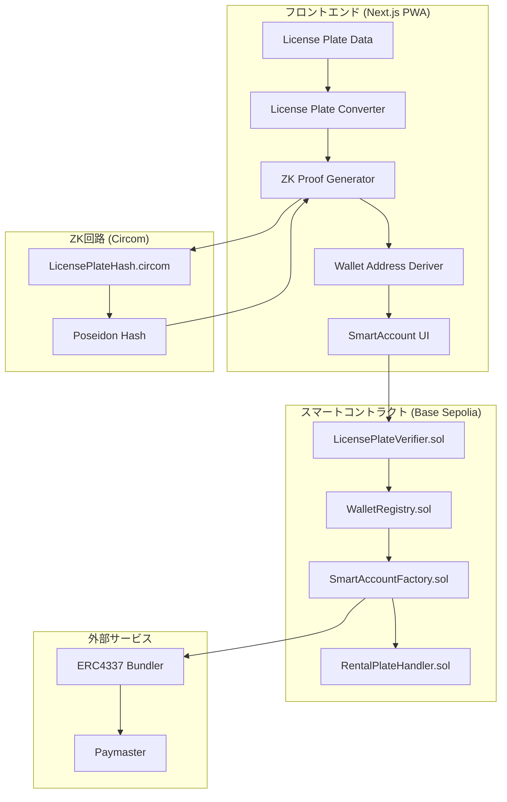
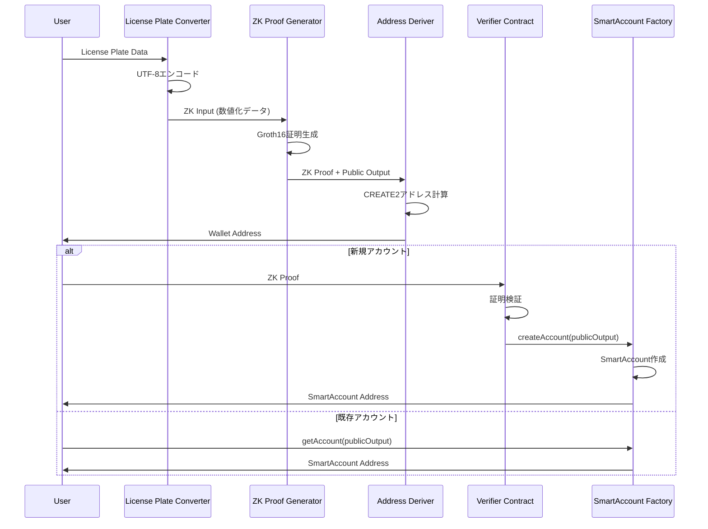

# 設計書

## 概要

本設計書は、ウォレットアドレス変換機能の技術的な実装方針を定義します。この機能は、ゼロ知識証明（Circom/Groth16）を使用してナンバープレート情報からウォレットアドレスを決定論的に導出し、プライバシーを保護しながらERC4337 SmartAccountを作成・取得するシステムを構築します。

### 設計目標

- ナンバープレート情報の完全なプライバシー保護
- 決定論的なアドレス導出（同一ナンバー → 同一アドレス）
- ERC4337 SmartAccount互換
- ブラウザ環境での証明生成（5秒以内）
- オンチェーン検証（300,000ガス以内）
- レンタカーナンバーの12時間再検証

## アーキテクチャ

### システム構成図



### データフロー



## コンポーネントとインターフェース

### フロントエンドコンポーネント

#### LicensePlateConverter

ナンバープレートデータをZK入力形式に変換するユーティリティ。

```typescript
// pkgs/frontend/lib/wallet/license-plate-converter.ts

interface LicensePlateData {
  region: string;              // 地名（例：品川）
  classificationNumber: string; // 分類番号（例：330）
  hiragana: string;            // ひらがな（例：あ）
  serialNumber: string;        // 一連番号（例：1234）
}

interface ZKInput {
  regionEncoded: bigint;       // 地名のUTF-8エンコード値
  classificationEncoded: bigint; // 分類番号の数値
  hiraganaEncoded: bigint;     // ひらがなのUTF-8エンコード値
  serialEncoded: bigint;       // 一連番号の数値
  salt: bigint;                // ランダムソルト（プライバシー強化）
}

interface ConversionResult {
  success: boolean;
  zkInput?: ZKInput;
  error?: ConversionError;
}

interface ConversionError {
  code: 'INVALID_REGION' | 'INVALID_CLASSIFICATION' | 'INVALID_HIRAGANA' | 'INVALID_SERIAL' | 'OVERFLOW';
  message: string;
}

function convertToZKInput(data: LicensePlateData): ConversionResult;
function encodeJapaneseToNumber(text: string): bigint;
function isWithinScalarField(value: bigint): boolean;
```

#### ZKProofGenerator

Groth16証明を生成するコンポーネント。

```typescript
// pkgs/frontend/lib/wallet/zk-proof-generator.ts

interface ZKProof {
  pi_a: [string, string, string];
  pi_b: [[string, string], [string, string], [string, string]];
  pi_c: [string, string, string];
  protocol: 'groth16';
  curve: 'bn128';
}

interface ProofResult {
  success: boolean;
  proof?: ZKProof;
  publicSignals?: string[];
  error?: ProofError;
}

interface ProofError {
  code: 'WASM_LOAD_FAILED' | 'ZKEY_LOAD_FAILED' | 'WITNESS_GENERATION_FAILED' | 'PROOF_GENERATION_FAILED' | 'TIMEOUT';
  message: string;
}

interface ProofGeneratorConfig {
  wasmPath: string;
  zkeyPath: string;
  timeout: number; // milliseconds
}

class ZKProofGenerator {
  constructor(config: ProofGeneratorConfig);
  async generateProof(input: ZKInput): Promise<ProofResult>;
  async verifyProofLocally(proof: ZKProof, publicSignals: string[]): Promise<boolean>;
}
```

#### WalletAddressDeriver

ZK証明の出力からウォレットアドレスを導出するコンポーネント。

```typescript
// pkgs/frontend/lib/wallet/address-deriver.ts

interface DerivedAddress {
  address: `0x${string}`;
  salt: bigint;
  initCodeHash: `0x${string}`;
}

interface DerivationResult {
  success: boolean;
  derivedAddress?: DerivedAddress;
  error?: DerivationError;
}

interface DerivationError {
  code: 'INVALID_PUBLIC_OUTPUT' | 'FACTORY_NOT_FOUND' | 'COMPUTATION_FAILED';
  message: string;
}

interface DeriverConfig {
  factoryAddress: `0x${string}`;
  accountImplementation: `0x${string}`;
}

class WalletAddressDeriver {
  constructor(config: DeriverConfig);
  deriveAddress(publicOutput: bigint): DerivationResult;
  computeCreate2Address(salt: bigint, initCodeHash: `0x${string}`): `0x${string}`;
}
```

### Circom回路

#### LicensePlateHash回路

```circom
// pkgs/circuit/src/LicensePlateHash.circom

pragma circom 2.0.0;

include "../node_modules/circomlib/circuits/poseidon.circom";

/**
 * ナンバープレートデータからハッシュを生成する回路
 * プライベート入力: ナンバープレートの各要素
 * パブリック出力: Poseidonハッシュ値
 */
template LicensePlateHash() {
    // プライベート入力
    signal input region;           // 地名（UTF-8エンコード）
    signal input classification;   // 分類番号
    signal input hiragana;         // ひらがな（UTF-8エンコード）
    signal input serial;           // 一連番号
    signal input salt;             // ソルト

    // パブリック出力
    signal output hash;

    // Poseidonハッシュ（5入力）
    component poseidon = Poseidon(5);
    poseidon.inputs[0] <== region;
    poseidon.inputs[1] <== classification;
    poseidon.inputs[2] <== hiragana;
    poseidon.inputs[3] <== serial;
    poseidon.inputs[4] <== salt;

    hash <== poseidon.out;
}

// パブリック出力: ハッシュ値
// プライベート入力: region, classification, hiragana, serial, salt
component main {public []} = LicensePlateHash();
```

### スマートコントラクト

#### LicensePlateVerifier

```solidity
// pkgs/contract/contracts/LicensePlateVerifier.sol

// SPDX-License-Identifier: MIT
pragma solidity ^0.8.20;

/**
 * @title LicensePlateVerifier
 * @notice Groth16証明を検証するコントラクト
 * @dev snarkjsで生成されたverifier.solをベースに拡張
 */
contract LicensePlateVerifier {
    // Groth16検証ロジック（snarkjs生成）

    event ProofVerified(bytes32 indexed publicOutputHash, bool valid);

    function verifyProof(
        uint[2] memory a,
        uint[2][2] memory b,
        uint[2] memory c,
        uint[1] memory input
    ) public view returns (bool);

    function verifyAndEmit(
        uint[2] memory a,
        uint[2][2] memory b,
        uint[2] memory c,
        uint[1] memory input
    ) public returns (bool);
}
```

#### WalletRegistry

```solidity
// pkgs/contract/contracts/WalletRegistry.sol

// SPDX-License-Identifier: MIT
pragma solidity ^0.8.20;

import "./LicensePlateVerifier.sol";

/**
 * @title WalletRegistry
 * @notice ナンバープレートハッシュとウォレットアドレスの紐付けを管理
 */
contract WalletRegistry {
    LicensePlateVerifier public verifier;

    // ハッシュ → ウォレットアドレス
    mapping(uint256 => address) public walletAddresses;

    // レンタカーナンバーの有効期限
    mapping(uint256 => uint256) public rentalExpiry;

    event WalletRegistered(uint256 indexed plateHash, address wallet);
    event RentalVerified(uint256 indexed plateHash, uint256 expiry);

    function registerWallet(
        uint[2] memory a,
        uint[2][2] memory b,
        uint[2] memory c,
        uint[1] memory input,
        bool isRental
    ) external returns (address);

    function getWallet(uint256 plateHash) external view returns (address);

    function isRentalValid(uint256 plateHash) external view returns (bool);

    function refreshRentalExpiry(
        uint[2] memory a,
        uint[2][2] memory b,
        uint[2] memory c,
        uint[1] memory input
    ) external;
}
```

#### SmartAccountFactory

```solidity
// pkgs/contract/contracts/SmartAccountFactory.sol

// SPDX-License-Identifier: MIT
pragma solidity ^0.8.20;

import "@account-abstraction/contracts/interfaces/IEntryPoint.sol";

/**
 * @title SmartAccountFactory
 * @notice ERC4337準拠のSmartAccountを作成するファクトリー
 */
contract SmartAccountFactory {
    IEntryPoint public immutable entryPoint;
    address public immutable accountImplementation;

    event AccountCreated(address indexed account, uint256 indexed salt);

    function createAccount(uint256 salt) external returns (address);

    function getAddress(uint256 salt) external view returns (address);

    function computeAddress(uint256 salt) public view returns (address);
}
```

## データモデル

### ZK入力エンコーディング

```typescript
// 日本語文字のエンコーディング仕様

// 地名エンコーディング（最大8文字 = 24バイト）
// UTF-8バイト列を256進数として解釈
// 例: "品川" = [0xE5, 0x93, 0x81, 0xE5, 0xB7, 0x9D]
//     = 0xE59381E5B79D (bigint)

// ひらがなエンコーディング（1文字 = 3バイト）
// 例: "あ" = [0xE3, 0x81, 0x82] = 0xE38182 (bigint)

// 分類番号・一連番号は直接数値化
// 例: "330" = 330n, "1234" = 1234n
```

### レンタカー判定ロジック

```typescript
// レンタカー・カーシェアナンバーの判定
const RENTAL_HIRAGANA = ['わ', 'れ'];

function isRentalPlate(hiragana: string): boolean {
  return RENTAL_HIRAGANA.includes(hiragana);
}

// 有効期限: 12時間
const RENTAL_VALIDITY_PERIOD = 12 * 60 * 60; // seconds
```

### SmartAccountデータ構造

```typescript
interface SmartAccountInfo {
  address: `0x${string}`;
  plateHash: bigint;
  isRental: boolean;
  rentalExpiry?: number; // Unix timestamp
  createdAt: number;
  lastVerified: number;
}
```


## 正確性プロパティ

*プロパティとは、システムの全ての有効な実行において真であるべき特性や振る舞いです。プロパティは、人間が読める仕様と機械で検証可能な正確性保証の橋渡しをします。*

### Property 1: UTF-8エンコーディングのラウンドトリップ

*任意の* 有効な日本語文字列（地名、ひらがな）に対して、UTF-8エンコードして数値化し、その数値をデコードすると元の文字列と等しくなること。

**Validates: Requirements 1.2**

### Property 2: 変換の決定論性

*任意の* 有効なLicensePlateDataに対して、License_Plate_Converterを2回呼び出すと、両方の呼び出しで同一のZKInputが生成されること。

**Validates: Requirements 1.3**

### Property 3: スカラーフィールド範囲の保証

*任意の* 有効なLicensePlateDataに対して、生成されるZKInputの全てのフィールド（regionEncoded, classificationEncoded, hiraganaEncoded, serialEncoded）がsnark scalar field（21888242871839275222246405745257275088548364400416034343698204186575808495617未満）の範囲内であること。

**Validates: Requirements 1.5**

### Property 4: 無効入力のエラーハンドリング

*任意の* 無効なLicensePlateData（空文字列、不正な形式、範囲外の値）に対して、License_Plate_ConverterとWallet_Address_Deriverは適切なエラーコードとメッセージを含むエラーレスポンスを返すこと。

**Validates: Requirements 1.4, 3.5**

### Property 5: 証明のパブリック出力とPoseidonハッシュの一致

*任意の* 有効なZKInputに対して、生成されたZK証明のパブリック出力は、同じ入力に対するPoseidonハッシュの計算結果と等しいこと。

**Validates: Requirements 2.4**

### Property 6: 証明からのプライベートデータ非漏洩

*任意の* 生成されたZK証明とパブリックシグナルに対して、元のナンバープレート情報（region, classification, hiragana, serial）を復元することが不可能であること（パブリックシグナルにプライベート入力が含まれないこと）。

**Validates: Requirements 2.2**

### Property 7: アドレス導出の決定論性

*任意の* 有効なパブリック出力に対して、Wallet_Address_Deriverを複数回呼び出すと、全ての呼び出しで同一のウォレットアドレスが生成されること。

**Validates: Requirements 3.1, 3.2**

### Property 8: Ethereumアドレス形式の妥当性

*任意の* 導出されたウォレットアドレスに対して、そのアドレスは「0x」で始まり、その後に40桁の16進数文字（0-9, a-f）が続く形式であること。

**Validates: Requirements 3.3**

### Property 9: CREATE2アドレス計算の正確性

*任意の* パブリック出力に対して、導出されたアドレスはCREATE2の公式（keccak256(0xff ++ factory ++ salt ++ keccak256(initCode))[12:]）に従って計算されたアドレスと等しいこと。

**Validates: Requirements 3.4**

### Property 10: 証明検証の正確性

*任意の* 有効なZK証明に対して、Proof_Verifier_Contractはtrueを返し、*任意の* 無効または改ざんされた証明に対してはfalseを返すこと。

**Validates: Requirements 4.1, 4.2, 4.3**

### Property 11: カウンターファクチュアルアドレスの一致

*任意の* SmartAccountに対して、デプロイ前にSmartAccount_Factory.computeAddress()で計算されたアドレスは、実際にデプロイされたSmartAccountのアドレスと等しいこと。

**Validates: Requirements 5.4**

### Property 12: レンタカーナンバーの検出

*任意の* ナンバープレートデータに対して、ひらがなが「わ」または「れ」の場合にのみRental_Plate_HandlerはisRentalフラグをtrueに設定すること。

**Validates: Requirements 6.1**

### Property 13: レンタカー有効期限の管理

*任意の* レンタカーナンバーに対して、初回登録時に12時間の有効期限が設定され、再検証成功時に有効期限が12時間延長され、有効期限切れ後は再検証が要求されること。

**Validates: Requirements 6.2, 6.3, 6.5**

### Property 14: オンチェーンでのハッシュのみ保存

*任意の* 登録されたウォレットに対して、WalletRegistryコントラクトに保存されるのはナンバープレートのPoseidonハッシュのみであり、元のナンバープレート情報は保存されないこと。

**Validates: Requirements 7.3**

## エラーハンドリング

### エラーコード一覧

| エラーコード | 説明 | 推奨アクション |
|------------|------|--------------|
| `INVALID_REGION` | 無効な地名 | 正しい地名を入力してください |
| `INVALID_CLASSIFICATION` | 無効な分類番号 | 3桁の数字を入力してください |
| `INVALID_HIRAGANA` | 無効なひらがな | 有効なひらがなを入力してください |
| `INVALID_SERIAL` | 無効な一連番号 | 1-4桁の数字を入力してください |
| `OVERFLOW` | スカラーフィールド超過 | 入力値が大きすぎます |
| `WASM_LOAD_FAILED` | WASM読み込み失敗 | ページを再読み込みしてください |
| `ZKEY_LOAD_FAILED` | zkey読み込み失敗 | ページを再読み込みしてください |
| `WITNESS_GENERATION_FAILED` | witness生成失敗 | 入力値を確認してください |
| `PROOF_GENERATION_FAILED` | 証明生成失敗 | 再試行してください |
| `TIMEOUT` | タイムアウト | ネットワーク接続を確認してください |
| `INVALID_PUBLIC_OUTPUT` | 無効なパブリック出力 | 証明を再生成してください |
| `FACTORY_NOT_FOUND` | ファクトリー未検出 | ネットワーク設定を確認してください |
| `COMPUTATION_FAILED` | 計算失敗 | 再試行してください |
| `RENTAL_EXPIRED` | レンタカー有効期限切れ | 再検証を行ってください |

### リトライ戦略

```typescript
const RETRY_CONFIG = {
  proofGeneration: {
    maxRetries: 2,
    initialDelay: 500,
    maxDelay: 2000,
  },
  contractCall: {
    maxRetries: 3,
    initialDelay: 1000,
    maxDelay: 5000,
  },
};
```

## テスト戦略

### テストフレームワーク

- **フロントエンド**: Vitest + fast-check（プロパティベーステスト）
- **回路**: Mocha/Chai + circom_tester
- **コントラクト**: Hardhat Test + fast-check

### ユニットテスト

#### License Plate Converter

```typescript
// pkgs/frontend/__tests__/wallet/license-plate-converter.test.ts

describe('LicensePlateConverter', () => {
  it('should encode Japanese region name correctly', () => {
    const result = encodeJapaneseToNumber('品川');
    expect(result).toBe(0xE59381E5B79Dn);
  });

  it('should return error for empty region', () => {
    const result = convertToZKInput({ region: '', ... });
    expect(result.success).toBe(false);
    expect(result.error?.code).toBe('INVALID_REGION');
  });
});
```

#### ZK Proof Generator

```typescript
// pkgs/frontend/__tests__/wallet/zk-proof-generator.test.ts

describe('ZKProofGenerator', () => {
  it('should generate valid proof for valid input', async () => {
    const input = createValidZKInput();
    const result = await generator.generateProof(input);
    expect(result.success).toBe(true);
    expect(result.proof).toBeDefined();
  });
});
```

### プロパティベーステスト

```typescript
// pkgs/frontend/__tests__/wallet/license-plate-converter.property.test.ts
import * as fc from 'fast-check';

describe('LicensePlateConverter Properties', () => {
  // Feature: wallet-address-conversion, Property 1: UTF-8エンコーディングのラウンドトリップ
  it('should round-trip encode/decode Japanese strings', () => {
    fc.assert(
      fc.property(
        japaneseStringArbitrary(),
        (text) => {
          const encoded = encodeJapaneseToNumber(text);
          const decoded = decodeNumberToJapanese(encoded);
          return decoded === text;
        }
      ),
      { numRuns: 100 }
    );
  });

  // Feature: wallet-address-conversion, Property 2: 変換の決定論性
  it('should produce deterministic output for same input', () => {
    fc.assert(
      fc.property(
        validLicensePlateDataArbitrary(),
        (data) => {
          const result1 = convertToZKInput(data);
          const result2 = convertToZKInput(data);
          return (
            result1.zkInput?.regionEncoded === result2.zkInput?.regionEncoded &&
            result1.zkInput?.classificationEncoded === result2.zkInput?.classificationEncoded &&
            result1.zkInput?.hiraganaEncoded === result2.zkInput?.hiraganaEncoded &&
            result1.zkInput?.serialEncoded === result2.zkInput?.serialEncoded
          );
        }
      ),
      { numRuns: 100 }
    );
  });

  // Feature: wallet-address-conversion, Property 3: スカラーフィールド範囲の保証
  it('should produce values within snark scalar field', () => {
    const SNARK_SCALAR_FIELD = 21888242871839275222246405745257275088548364400416034343698204186575808495617n;
    fc.assert(
      fc.property(
        validLicensePlateDataArbitrary(),
        (data) => {
          const result = convertToZKInput(data);
          if (!result.success) return true;
          return (
            result.zkInput!.regionEncoded < SNARK_SCALAR_FIELD &&
            result.zkInput!.classificationEncoded < SNARK_SCALAR_FIELD &&
            result.zkInput!.hiraganaEncoded < SNARK_SCALAR_FIELD &&
            result.zkInput!.serialEncoded < SNARK_SCALAR_FIELD
          );
        }
      ),
      { numRuns: 100 }
    );
  });
});
```

```typescript
// pkgs/frontend/__tests__/wallet/address-deriver.property.test.ts
import * as fc from 'fast-check';

describe('WalletAddressDeriver Properties', () => {
  // Feature: wallet-address-conversion, Property 7: アドレス導出の決定論性
  it('should derive same address for same public output', () => {
    fc.assert(
      fc.property(
        validPublicOutputArbitrary(),
        (publicOutput) => {
          const result1 = deriver.deriveAddress(publicOutput);
          const result2 = deriver.deriveAddress(publicOutput);
          return result1.derivedAddress?.address === result2.derivedAddress?.address;
        }
      ),
      { numRuns: 100 }
    );
  });

  // Feature: wallet-address-conversion, Property 8: Ethereumアドレス形式の妥当性
  it('should produce valid Ethereum address format', () => {
    const ethereumAddressRegex = /^0x[0-9a-f]{40}$/i;
    fc.assert(
      fc.property(
        validPublicOutputArbitrary(),
        (publicOutput) => {
          const result = deriver.deriveAddress(publicOutput);
          if (!result.success) return true;
          return ethereumAddressRegex.test(result.derivedAddress!.address);
        }
      ),
      { numRuns: 100 }
    );
  });
});
```

```typescript
// pkgs/frontend/__tests__/wallet/rental-handler.property.test.ts
import * as fc from 'fast-check';

describe('RentalPlateHandler Properties', () => {
  // Feature: wallet-address-conversion, Property 12: レンタカーナンバーの検出
  it('should detect rental plates correctly', () => {
    fc.assert(
      fc.property(
        hiraganaArbitrary(),
        (hiragana) => {
          const isRental = isRentalPlate(hiragana);
          const expectedRental = hiragana === 'わ' || hiragana === 'れ';
          return isRental === expectedRental;
        }
      ),
      { numRuns: 100 }
    );
  });
});
```

### 回路テスト

```typescript
// pkgs/circuit/__tests__/LicensePlateHash.test.ts

describe('LicensePlateHash Circuit', () => {
  // Feature: wallet-address-conversion, Property 5: 証明のパブリック出力とPoseidonハッシュの一致
  it('should output correct Poseidon hash', async () => {
    const input = {
      region: 0xE59381E5B79Dn, // 品川
      classification: 330n,
      hiragana: 0xE38182n, // あ
      serial: 1234n,
      salt: 12345n,
    };

    const witness = await circuit.calculateWitness(input);
    const expectedHash = poseidon([
      input.region,
      input.classification,
      input.hiragana,
      input.serial,
      input.salt,
    ]);

    expect(witness[1]).toBe(expectedHash);
  });
});
```

### コントラクトテスト

```typescript
// pkgs/contract/__tests__/LicensePlateVerifier.test.ts

describe('LicensePlateVerifier', () => {
  // Feature: wallet-address-conversion, Property 10: 証明検証の正確性
  it('should verify valid proof', async () => {
    const { proof, publicSignals } = await generateValidProof();
    const result = await verifier.verifyProof(
      proof.pi_a,
      proof.pi_b,
      proof.pi_c,
      publicSignals
    );
    expect(result).toBe(true);
  });

  it('should reject invalid proof', async () => {
    const { proof, publicSignals } = await generateValidProof();
    // Tamper with proof
    proof.pi_a[0] = '0x' + '1'.repeat(64);
    const result = await verifier.verifyProof(
      proof.pi_a,
      proof.pi_b,
      proof.pi_c,
      publicSignals
    );
    expect(result).toBe(false);
  });
});
```

### テストデータ生成

```typescript
// pkgs/frontend/__tests__/arbitraries/wallet.ts
import * as fc from 'fast-check';

const REGIONS = ['品川', '横浜', '名古屋', '大阪', '神戸', '福岡', '札幌', '仙台'];
const HIRAGANA = ['あ', 'い', 'う', 'え', 'お', 'か', 'き', 'く', 'け', 'こ', 'わ', 'れ'];

export const validLicensePlateDataArbitrary = () =>
  fc.record({
    region: fc.constantFrom(...REGIONS),
    classificationNumber: fc.stringOf(
      fc.constantFrom('0', '1', '2', '3', '4', '5', '6', '7', '8', '9'),
      { minLength: 3, maxLength: 3 }
    ),
    hiragana: fc.constantFrom(...HIRAGANA),
    serialNumber: fc.stringOf(
      fc.constantFrom('0', '1', '2', '3', '4', '5', '6', '7', '8', '9'),
      { minLength: 1, maxLength: 4 }
    ),
  });

export const hiraganaArbitrary = () => fc.constantFrom(...HIRAGANA);

export const validPublicOutputArbitrary = () =>
  fc.bigInt({ min: 1n, max: 21888242871839275222246405745257275088548364400416034343698204186575808495616n });

export const japaneseStringArbitrary = () =>
  fc.stringOf(
    fc.integer({ min: 0x3040, max: 0x309F }).map(code => String.fromCharCode(code)),
    { minLength: 1, maxLength: 8 }
  );
```

### テストカバレッジ目標

- ユニットテスト: 80%以上
- プロパティテスト: 全ての正確性プロパティをカバー
- 回路テスト: 全ての制約をカバー
- コントラクトテスト: 全ての関数をカバー
