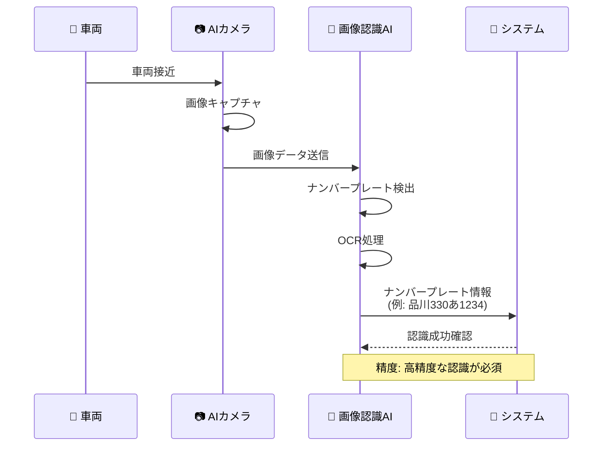
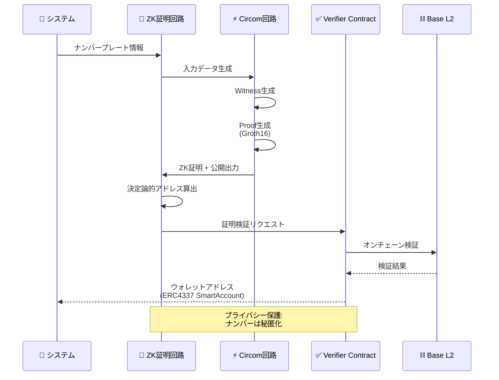
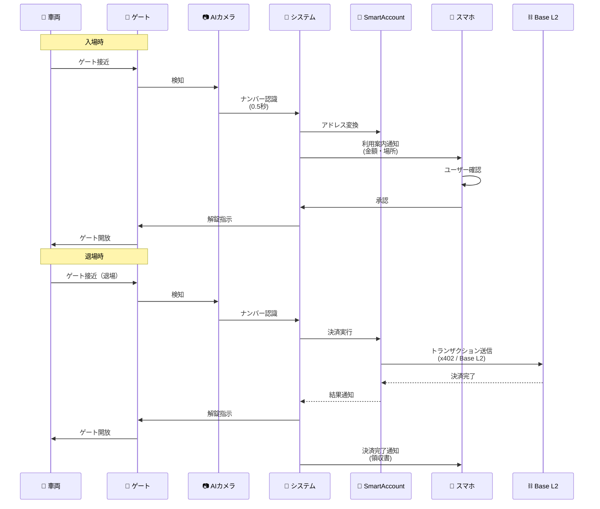
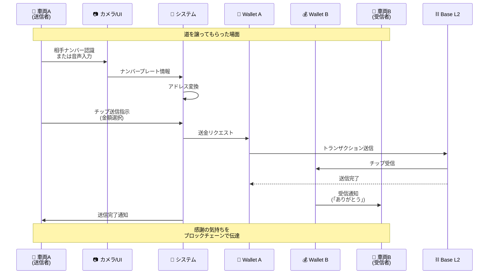
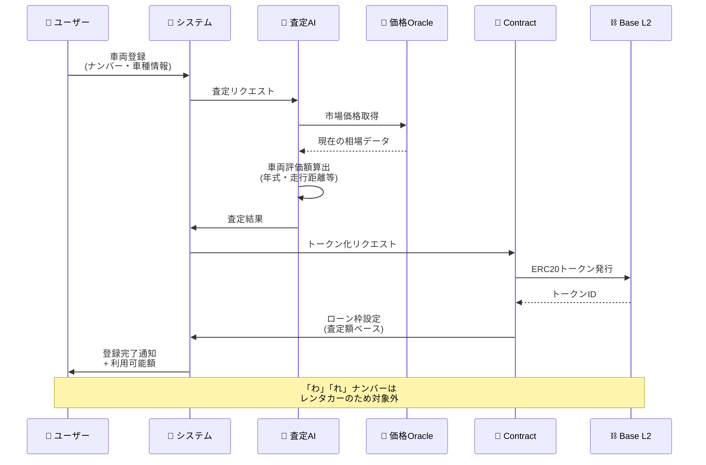

# car

次世代モーティブ生成AIハッカソン用のリポジトリです。

## 概要

**「ナンバープレート連動ウォレットシステム」** は、ブロックチェーン（Web3）とAI技術を融合させた次世代のモビリティプラットフォームです。最大の特長は、車両のナンバープレートそのものを「ウォレットID」化する点にあります。

これにより、専用アプリの操作を必要とせず、走行するだけで相手や施設を特定し、シームレスな決済やデータ連携を可能にします。技術スタックとしては、低コスト・高速決済を実現する「Base L2」ブロックチェーンや、画像・音声認識を統合したマルチモーダルAI「Qwen」を採用しており、実用性の高いスケーラブルな構成となっています,。

## 解決したい課題

このプロダクトは、現在のモビリティ社会における「ユーザーの摩擦」と「社会的な非効率性」の解決を目指しています。

- **現場の摩擦・ユーザー負担**:
    駐車場精算機での小銭探しや雨天時の窓開け操作、ドライブスルーでの長い待ち時間、運転中のスマホ操作による危険性などが挙げられます,。
- **証拠の信頼性不足**:
    ドライブレコーダー映像の改ざんリスクや、事故時の証拠提出手続きの複雑さが課題となっています。
- **データの死蔵と非還元**:
    膨大な走行データが活用されず、データ提供者であるドライバーへのインセンティブも存在しません。
- **社会・制度課題**:
    観光地でのオーバーツーリズム（渋滞）や、既存のETC・ゲートシステムの導入・維持コストが極めて高い（中小施設には障壁となる）という問題があります。

## このプロダクトで実現できること

「車に乗ったままで何でもできる」世界の実現により、以下のような具体的な価値を提供します。

- **フリクションレスな自動決済**:
    - **ゲート自動決済**:
        AIカメラがナンバーを認識し、0.5秒でゲート解錠と決済を完了させます。
    - **ドライブスルー革命**:
        店舗到着と同時に注文・決済が完了し、待ち時間ゼロで商品を受け取れます。
- **安全で高度な運転支援**:
    - **AIコンシェルジュ**:
        音声AIにより、運転中に「近くの空いてる駐車場」を検索・予約・決済までハンズフリーで完結できます。
    - **デジタル証拠登録**:
        映像をブロックチェーンに即時記録することで、改ざん不可能な証拠として事故解決を迅速化します。
- **新たな経済圏の創出**:
    - **データ収益化**:
        走行データを匿名化して販売し、収益の70%をユーザーへ還元する「走るほど稼げる」仕組みを提供します（月間平均640円の報酬を想定）。
    - **P2P投げ銭**:
        運転中に道を譲ってもらった際などの感謝を、ナンバー認識を通じてチップとして送ることができます。
- お金が無くても大丈夫。自分の車を登録した時に車の価値が査定され、その金額をローン枠として利用できすぐに使うことが出来ます。（「わ」「れ」ナンバーの車はレンタカーやカーシェアなので使えません。）
- **社会的インパクト**:
    - ダイナミックプライシング（混雑に応じた価格変動）により、観光地の渋滞を最大30%緩和します。
    - 降車回数や窓開け操作を90%削減し、店舗の回転率を30%向上させます。

## 実現方法

1. 車のナンバープレートを画像認識して抽出(この値が重要になるので画像の認識の精度は非常に重要)
2. 抽出した情報をZKで秘匿化(パスワードハッシュ化と同じでも良いかも)
3. その値を使ったAA用のSmartAccount(ERC4337規格準拠)を作成する。
4. スマホなどに金額案内などと同時に利用承認の通知が来る。
5. 承認したらゲートが開く
6. 出るときAIカメラで自動的にゲートを開けるのと課金トランザクション発生(課金する時にx402を使う？？)

## 機能一覧表

| 機能 | 説明 | ステータス |
|:------|:------|:------------|
|ナンバープレート認識機能|車のナンバープレートの情報を認識する。||
|ウォレットアドレス変換機能|ゼロ知識証明により内容を秘匿化しながら決定論的にナンバープレートからウォレットアドレスを算出する機能||
|自動車の価値を算出する機能(トークン化)|自動車の現在の評価額をトークン化する機能||
|チップ機能|道とかを譲ってもらった機能(支払い方法についてはx402を送信する)||

## 機能ごとの処理シーケンス図

### 1. ナンバープレート認識機能



### 2. ウォレットアドレス変換機能



### 3. ゲート自動決済フロー（統合）



### 4. チップ機能（P2P投げ銭）



### 5. 車両価値トークン化フロー



## 将来構想

自動車の走行履歴や自動車間のトランザクションのやり取りを分散型ナレッジグラフネットワークに書き込み、社会の実情を反映した渋滞予測などのプログラムを作成することに繋げる。

本取り組みはその足がかりとなるもの。

## 技術スタック
| カテゴリ | 技術 |
|---------|------|
| **フロントエンド** | Next.js<br/>TypeScript<br/>TailwindCSS<br/> Shadcn/ui<br/>React Bits<br/>biome |
| **バックエンド** | laravel<br/> php<br/> flask<br/> python <br/> Hono <br/> TypeScript|
| **AI** | Qwen<br/> allenai/Molmo2-8B <br/> MCP|
| **Web3** | Base Sepolia<br/>AA<br/> SmartAccount<br/> ゼロ知識証明<br/> Solidity<br/> Circom<br/> x402 |

## 動かし方

### セットアップ

#### 1. リポジトリのクローンと依存関係のインストール
```bash
git clone <repository-url>
cd car
pnpm install
```

#### 2. 環境変数の設定
`pkgs/contract/.env` ファイルを作成し、以下を設定：
```bash
PRIVATE_KEY=<your-wallet-private-key>
ALCHMEY_API_KEY=<your-alchemy-api-key>
BASESCAN_API_KEY=<your-basescan-api-key>
```

### フロントエンド

#### 開発サーバーの起動
```bash
pnpm frontend dev
```

ブラウザで http://localhost:3000 にアクセス

#### 本番ビルド
```bash
pnpm frontend build
pnpm frontend start
```

#### PWAアイコン生成
```bash
pnpm frontend generate:icons
```

### サーキット（ZK証明回路）

#### 完全な実行フロー
```bash
# 1. 回路のコンパイル（.circom → R1CS, WASM, C++）
pnpm circuit compile

# 2. 入力データの生成
pnpm circuit generateInput

# 3. Witness（証人）の生成
pnpm circuit generateWitness

# 4. Groth16証明の生成と検証
pnpm circuit executeGroth16

# 5. テストの実行
pnpm circuit test
```

#### 生成ファイルの配布
```bash
# Verifierコントラクトをcontractパッケージにコピー
pnpm circuit cp:verifier

# ZKファイル（WASM, zkey）をbackend/frontendにコピー
pnpm circuit cp:zk
```

### コントラクト（スマートコントラクト）

#### 開発フロー
```bash
# コンパイル
pnpm contract compile

# テストの実行
pnpm contract test

# カバレッジ取得
pnpm contract coverage
```

#### デプロイ（Base Sepolia）
```bash
# PasswordHashVerifierのデプロイ＆検証
pnpm contract deploy:PasswordHashVerifier

# デプロイ済みコントラクトの検証
pnpm contract verify
```

#### ローカル開発
```bash
# ローカルHardhatノードの起動
pnpm contract local

# アカウント残高確認
pnpm contract getBalance

# チェーン情報取得
pnpm contract getChainInfo
```

### コード品質チェック

プロジェクトルートで以下を実行：
```bash
# コードフォーマット
pnpm format

# リント（修正含む）
pnpm lint
```

### x402サーバー

#### ローカルでx402サーバーを起動すること

```bash
pnpm x402server dev
```

### MCPサーバー

#### MCPサーバーのビルド

```bash
pnpm mcp build
```

#### MCPサーバーの起動

```bash
pnpm mcp dev
```

### バックエンド・API
/laravel/
上記フォルダ以下にlaravel11のプロジェクトを展開。
DBのマイグレーションは必ずlaravelで行うこと。
DBはmysql8をインストールしてある
APIも基本はこちらで作ること
APIのルートは/api/以下にするように

### バッチ・バックエンド・API
/python/
上記フォルダにpythonで作られたソースは置くこと。
フレームワークは必須ではないが、使うならflaskを使うこと。
pythonでAPI作る場合はこちらに作ること。
APIのルートは/papi/以下にすること

### ドキュメント
APIのドキュメントは/docs/以下に置くこと
APIを更新したらAPIドキュメントを記載すること。
APIのドキュメントはphp側とpython側で別けるのみで、細かく分けないこと。

